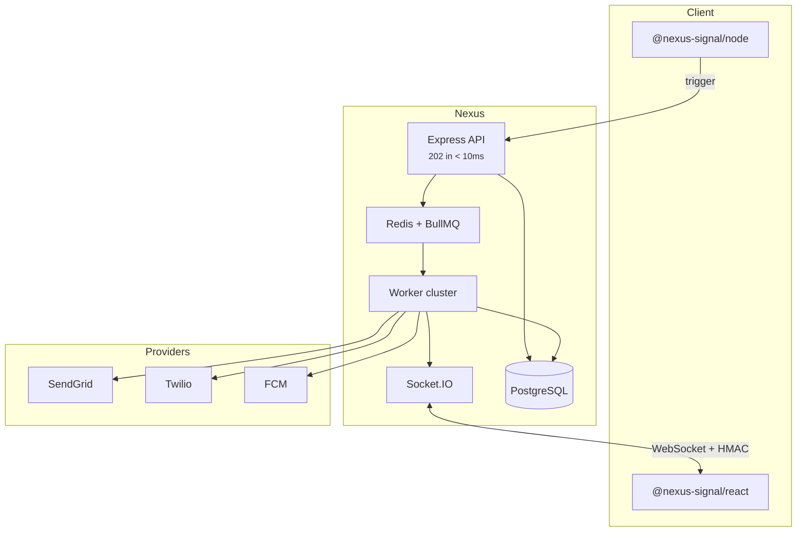

## System diagram

## Components

| Layer         | Technology          | Role                                        |
| ------------- | ------------------- | ------------------------------------------- |
| Ingestion API | Node.js + Express   | Auth, validate, enqueue, return 202         |
| Core database | PostgreSQL + Prisma | Orgs, workflows, subscribers, logs          |
| Queue         | Redis + BullMQ      | Async jobs, delays, digest, circuit breaker |
| Workers       | Node.js             | Execute steps, compile templates, dispatch  |
| Realtime      | Socket.IO           | In-app, read sync, sandbox simulator        |
| Dashboard     | React SPA           | Canvas, templates, analytics                |

## Non-blocking ingestion

The API **never** calls carriers or compiles heavy templates during the HTTP request. It writes an `INGESTED` log, enqueues a job, and responds immediately.

## Multi-tenancy

Resources are scoped to **organization** → **environment** (Development, Staging, Production). Each environment has isolated keys, subscribers, and workflows.

<Callout type="idea">
  Development uses **sandbox mode** — external channels are simulated so you
  test without provider spend. See [Sandbox](/docs/platform/features/sandbox).
</Callout>

## Related

- [Delivery pipeline](/docs/platform/concepts/delivery-pipeline)
- [BYOP](/docs/platform/concepts/byop)
