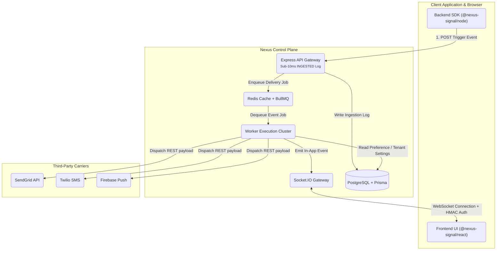

# System Architecture

Nexus Signal is designed as a high-throughput, decoupled notification orchestration system. The platform consists of five primary layers to separate trigger ingestion from actual notification compilation and delivery:

---

## System Diagram

```mermaid
flowchart TB
  subgraph Client [Client Application & Browser]
    SDK("Backend SDK (@nexus-signal/node)")
    UI("Frontend UI (@nexus-signal/react)")
  end

  subgraph Nexus [Nexus Control Plane]
    API("Express API Gateway<br/><small>Sub-10ms INGESTED Log</small>")
    Q("Redis Cache + BullMQ")
    W("Worker Execution Cluster")
    WS("Socket.IO Gateway")
    DB[(PostgreSQL + Prisma)]
  end

  subgraph Providers [Third-Party Carriers]
    SG(SendGrid API)
    TW(Twilio SMS)
    FCM(Firebase Push)
  end

  SDK -->|1. POST Trigger Event| API
  API -->|Write Ingestion Log| DB
  API -->|Enqueue Delivery Job| Q
  Q -->|Dequeue Event Job| W
  W -->|Read Preference / Tenant Settings| DB
  W -->|Dispatch REST payload| SG & TW & FCM
  W -->|Emit In-App Event| WS
  WS <-->|WebSocket Connection + HMAC Auth| UI
```

---

## Architectural Components

| Component          | Technology          | Responsibility                                                                                              | Performance                |
| :----------------- | :------------------ | :---------------------------------------------------------------------------------------------------------- | :------------------------- |
| **Ingestion API**  | Node.js + Express   | Validates authorization credentials and trigger schemas; enqueues jobs; returns immediate confirmation.     | Sub-10ms response times.   |
| **Relational DB**  | PostgreSQL + Prisma | Persists workspace config, environment credentials, template structures, subscribers, and transaction logs. | Indexed read/write path.   |
| **Message Broker** | Redis + BullMQ      | Manages real-time queue channels, delayed workflows, batch digests, and backpressure scheduling.            | Memory-cached performance. |
| **Workers**        | Node.js Worker Pool | Executes workflow nodes sequentially; handles local timezone adjustments, A/B splits, and dispatches.       | Horizontally scalable.     |
| **WebSocket Hub**  | Socket.IO Gateway   | Maintains persistent WebSocket channels to active browsers for delivering instant in-app alerts.            | Event-driven pushes.       |
| **Web Dashboard**  | React + Next.js SPA | visual drag-and-drop template designer, execution logs, and sandbox simulators.                             | Static client rendering.   |

---

## Non-Blocking Event Ingestion

To maintain sub-10ms response times on your backend triggers, the Ingestion API **never** performs any of the following tasks synchronously:

- Compiling template engines.
- Evaluating conditional step branch rules.
- Performing DNS lookups or HTTP REST requests to external carrier gateways (e.g. SendGrid, Twilio).

Instead, the gateway writes a single row to PostgreSQL with state `INGESTED`, publishes the payload metadata to BullMQ, and immediately responds to your server SDK with an **HTTP 202 Accepted** status code containing the transaction ID.

---

## Queue Resilience & Backpressure

By relying on BullMQ, Nexus protects your backend systems from network latencies and carrier downtimes:

- **Job Retries**: If Twilio or SendGrid returns an HTTP 500 or experiences rate limits, the worker enqueues the job back to Redis using an **exponential backoff** strategy.
- **Circuit Breaking**: If a carrier returns continuous failures over a threshold window, the dispatcher triggers a **Failover Node** to route notifications over an alternate channel (e.g. fallback from SMS to Push).
- **Rate Throttling**: Workers route messages strictly respecting rate limits configured per provider integration.

---

## Persistent WebSocket Gateway

In-app notifications (such as notification bells or custom toast messages) are routed through our dedicated Socket.IO WebSocket gateway.

- **Security**: Handshakes require a valid HMAC signature generated by your server, preventing user ID spoofing.
- **Delivery state**: If a user is actively connected via WebSocket, the worker can skip dispatching external channels like SMS or Push (Presence suppression), lowering messaging costs.
