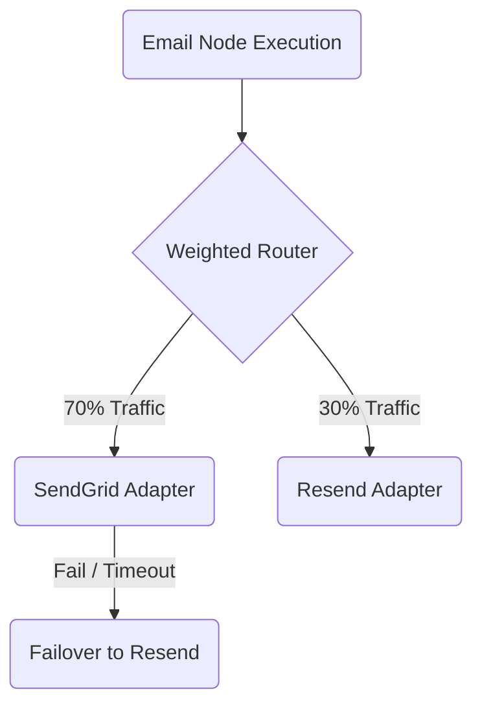

# Bring Your Own Provider (BYOP)

**BYOP (Bring Your Own Provider)** is the foundation of Nexus Signal. Unlike legacy notification platforms that act as middleman carriers and charge a markup on every email or SMS, Nexus acts purely as the orchestration software layer.

You enter **your own API keys** for providers and pay carrier billing rates directly at cost.

---

## Traditional vs. BYOP Cost Analysis

Notification volumes often scale rapidly, turning per-message markups into a major overhead:

| Metric                     | Traditional Notification SaaS               | Nexus Signal (BYOP)                                        |
| :------------------------- | :------------------------------------------ | :--------------------------------------------------------- |
| **Billing Model**          | Subscriptions + per-message volume markup.  | Flat-rate platform subscription only.                      |
| **Message Markup**         | Frequently marked up by 50% to 200%.        | **0% markup**. You pay the carrier directly at cost.       |
| **Carrier Redundancy**     | Locked to the platform's selected carrier.  | Weighted routing and instant failover across your vendors. |
| **Deliverability Control** | Shared IP reputation pools (poor inboxing). | Dedicated IP selection and direct sender configuration.    |

---

## Secure Vault Encryption

Because you supply your own credentials, protecting your API keys is our highest security priority.

- **AES-256 Encryption**: Provider credentials are encrypted at the database level inside your workspace `providerKeys` vault.
- **Decryption Scope**: Keys are decrypted in memory strictly at the time of carrier dispatch inside isolated worker processes.
- **Zero Log Exposure**: Payload logging automatically sanitizes authentication details and API tokens to prevent keys from leaking in delivery trace logs.

---

## Routing & Redundancy

With BYOP, you are not dependent on a single carrier. You can configure multiple provider accounts for a single channel (e.g. Email) and allocate traffic dynamically:

- **Weighted Routing**: Allocate `70%` of email traffic to SendGrid and `30%` to Resend to maintain warm IP addresses across multiple suppliers.
- **Instant Failover**: If a SendGrid API call times out or returns a rate limit exception, the worker immediately dispatches the message via Resend.

---

## AI Keys are BYOP Too

Nexus Signal supports visual workflow **AI Nodes** (e.g., for translation verification or dynamic copywriting triggers). These nodes use **your own LLM keys** (OpenAI, Anthropic, or Cohere). Nexus never runs LLM tasks over shared proxy accounts. You maintain complete control over data privacy policies and token usage limits.
