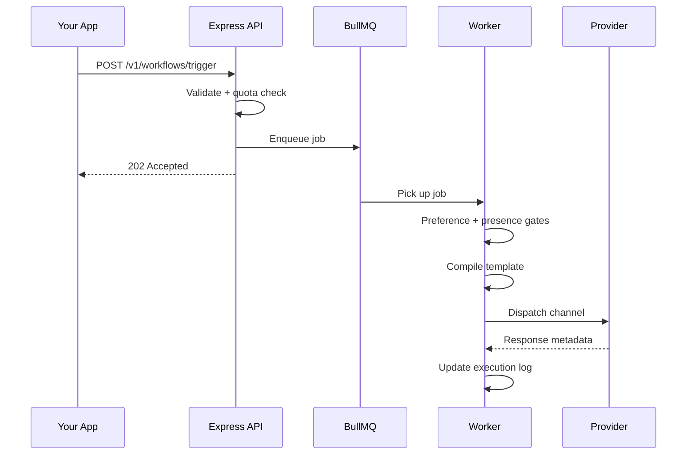

When you call `workflows.trigger`, this pipeline runs asynchronously.

## Step summary

| Step | What happens |
|------|----------------|
| **Ingestion** | Validate key, resolve subscribers, create log, enqueue |
| **Worker pickup** | Load workflow, template, organization context |
| **Gates** | Preferences, presence suppression, smart timing, delivery window |
| **Compile** | Handlebars + locale resolution + click tracking URLs |
| **Dispatch** | Weighted provider router → carrier adapter |
| **Telemetry** | WebSocket (in-app), click tracking, carrier callbacks |

## Lifecycle statuses

`INGESTED` → `QUEUED` → `PROCESSING` → `DISPATCHED` → `DELIVERED` → `READ` / `OPENED` / `FAILED`

Special: `SKIPPED_BY_PREFERENCE`, `QUEUED_IN_DIGEST`, `FAILED_PROVIDER_DOWN`

<Callout type="warn">
Scheduled triggers and smart-timing holds re-enter the queue with a delay — status may show `QUEUED` during the wait.
</Callout>

View the full timeline in **Audit Logs** drill-down.
