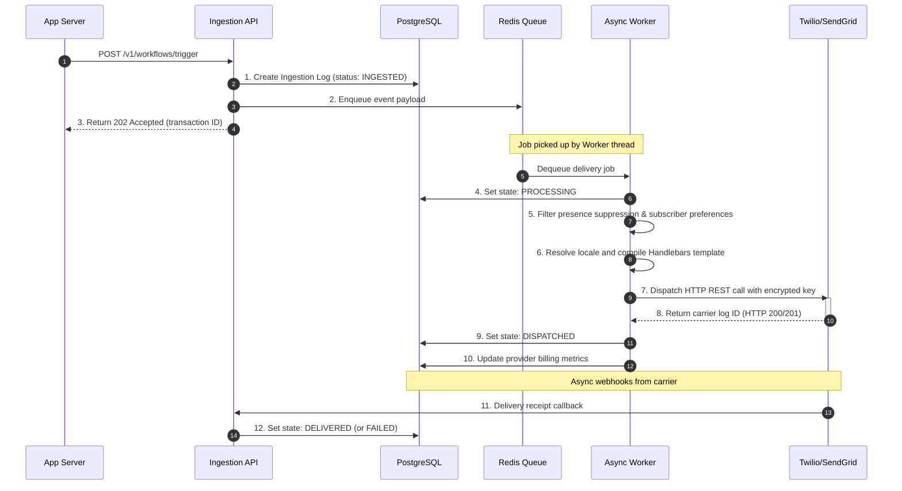

# Delivery Pipeline

When your application server triggers an event via `nexus.workflows.trigger()`, the event enters a high-throughput, observable execution pipeline. Delivery runs fully asynchronously inside our background worker pools.

---

## Detailed Telemetry Sequence

The following diagram tracks the transaction path from ingestion through templates, preference checks, carrier adapters, and carrier delivery reports:

```mermaid
sequenceDiagram
    autonumber
    participant App as App Server
    participant API as Ingestion API
    participant DB as PostgreSQL
    participant Q as Redis Queue
    participant W as Async Worker
    participant Carrier as Twilio/SendGrid

    App->>API: POST /v1/workflows/trigger
    API->>DB: 1. Create Ingestion Log (status: INGESTED)
    API->>Q: 2. Enqueue event payload
    API-->>App: 3. Return 202 Accepted (transaction ID)

    Note over Q, W: Job picked up by Worker thread
    Q->>W: Dequeue delivery job
    W->>DB: 4. Set state: PROCESSING
    W->>W: 5. Filter presence suppression & subscriber preferences
    W->>W: 6. Resolve locale and compile Handlebars template
    W->>Carrier: 7. Dispatch HTTP REST call with encrypted key
    activate Carrier
    Carrier-->>W: 8. Return carrier log ID (HTTP 200/201)
    deactivate Carrier

    W->>DB: 9. Set state: DISPATCHED
    W->>DB: 10. Update provider billing metrics

    Note over Carrier, DB: Async webhooks from carrier
    Carrier->>API: 11. Delivery receipt callback
    API->>DB: 12. Set state: DELIVERED (or FAILED)
```

---

## Execution Pipeline Phases

### 1. Ingestion Phase

- **Authentication**: Checks the Bearer Secret Key (`sk_`) scope.
- **Validation**: Confirms that `workflowName` exists and validates the `recipients` array schemas.
- **Job Creation**: Generates a persistent unique ID for each target recipient, registers the initial `INGESTED` row in the database, pushes the execution context to BullMQ, and releases the API thread.

### 2. Preference & Presence Gates

Before compiling message assets, workers evaluate whether the notification should proceed:

- **Opt-out Verification**: Reads the recipient's preference catalog. If they have opted out of the topic or channel, the node is bypassed with state `SKIPPED_BY_PREFERENCE`.
- **Active Presence Interception**: Checks if the recipient has an active WebSocket session in the in-app gateway. If `suppressWhenOnline` is active on the channel node, outbound dispatches are skipped.
- **Local Time Constraints**: If a `Delivery Window` node is present, the worker calculates the subscriber's local timezone offset. If the current hour falls outside the window, the job is delayed in Redis.

### 3. Template Rendering

- **Locale Lookup**: Resolves the subscriber's preferred locale (`en`, `es`, `ja`, etc.).
- **Handlebars Compilation**: Compiles subject lines, headings, and HTML templates, merging trigger `data` variables.
- **Trace Link injection**: Replaces URLs in the templates with custom redirection tracking links to measure click-through metrics.

### 4. Carrier Dispatch

- **Weighted Routing**: The dispatcher resolves active provider adapters and selects the carrier based on integration weights.
- **Adapter Handshake**: Decrypts the integration key, compiles the provider's specific API schema, and executes the REST call.

---

## In-depth Lifecycle Status Definitions

Every delivery job transitions through a set of observable states:

| Status State            | Meaning & Scope                                                               |
| :---------------------- | :---------------------------------------------------------------------------- |
| `INGESTED`              | The API has accepted the trigger event payload.                               |
| `QUEUED`                | The job is currently sitting in Redis waiting for worker threads.             |
| `PROCESSING`            | A worker is currently executing template rendering and gateway gates.         |
| `DISPATCHED`            | The message was accepted by the carrier API (SendGrid, Twilio, etc.).         |
| `DELIVERED`             | The carrier webhook confirmed the user received the email/SMS/push.           |
| `OPENED` / `READ`       | The user opened the email (pixel fired) or marked the in-app message as read. |
| `FAILED`                | An error occurred during execution or the carrier rejected delivery.          |
| `SKIPPED_BY_PREFERENCE` | Delivery was bypassed because the subscriber unsubscribed from the topic.     |
| `QUEUED_IN_DIGEST`      | The event is suspended waiting for the digest node batching interval.         |
| `FAILED_PROVIDER_DOWN`  | Carrier gateway was unreachable; queued for automatic failover.               |

---

## Retry & Error Recovery

If a carrier dispatch fails due to carrier network drops or temporary HTTP 5xx exceptions, workers execute the following recovery routines:

1.  **Retry Queuing**: The worker enqueues the job back to Redis using an **exponential backoff** strategy.
2.  **Max Retries**: The job is retried up to 5 times (configured under Integrations).
3.  **Dead-Letter Queue (DLQ)**: If all retries are exhausted, the state is set to `FAILED`, the stack trace is saved to the audit log, and developer alerts are triggered.
