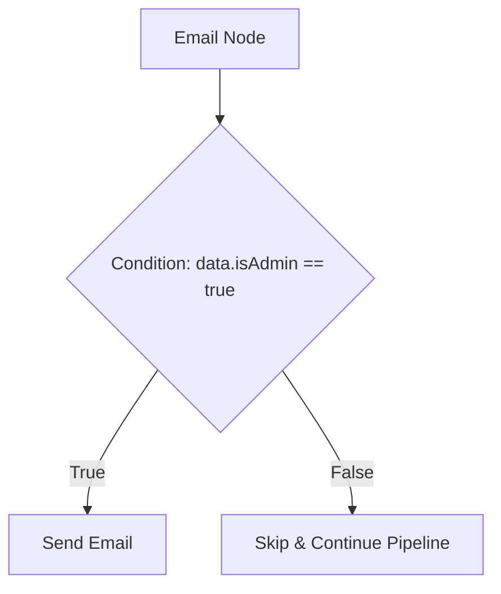

# Visual Workflows & Templates

A **workflow** is the structural automation plan (`user.welcome`, `billing.payment_failed`) that handles your event triggers. Workflows are composed visually in the dashboard canvas as a **step tree** of functional nodes.

---

## Trigger Events

Every workflow starts with a single **Trigger Node** defining the event namespace. When your application server triggers an event using the SDK, the `workflowName` parameter must match this visual identifier:

```ts
await nexus.workflows.trigger({
  workflowName: 'user.welcome', // Matches the trigger node namespace
  recipients: [{ externalId: 'user_12' }],
  data: { name: 'Alex' },
});
```

---

## Detailed Node Catalog

The canvas visual builder supports ten node classes to control message timing, execution logic, and provider choices:

| Node Class          | Icon            | Action & Function                                                                                                                                               |
| :------------------ | :-------------- | :-------------------------------------------------------------------------------------------------------------------------------------------------------------- |
| **Channel Node**    | `MessageSquare` | Dispatches notifications over Email, SMS, Web Push, Mobile Push, In-App bell, Slack, Discord, Microsoft Teams, WhatsApp, or Webhooks.                           |
| **Delay Node**      | `Clock`         | Pauses execution for a relative duration (e.g. `24 hours` or `3 days`) before executing the next step.                                                          |
| **Wait Until Node** | `Calendar`      | Holds execution until a dynamic ISO-8601 timestamp passed in your trigger payload (e.g. `data.trialExpirationDate`).                                            |
| **Delivery Window** | `Moon`          | Intercepts delivery and holds notifications to release them strictly during subscriber-friendly hours (e.g. `9:00 AM - 6:00 PM`) matching their local timezone. |
| **Digest Node**     | `Archive`       | Collapses high-frequency alerts into a single consolidated summary index (e.g., batching 10 comment notifications over 30 minutes into one digest).             |
| **Throttle Node**   | `Activity`      | Rate-limits notification dispatches to prevent spamming subscribers (e.g. max `1 email per hour` per subscriber).                                               |
| **Failover Node**   | `RefreshCw`     | Attempts a primary channel, waits for a read callback (or specific duration), and automatically falls back to secondary channels if not read.                   |
| **A/B Split Node**  | `Split`         | Splits execution traffic down two branches (e.g. `50% Branch A`, `50% Branch B`) with trackable open and click metrics to optimize copy.                        |
| **HTTP Fetch Node** | `Globe`         | Fetches external data from third-party APIs mid-workflow. Merges JSON response properties directly into the Handlebars context variables.                       |
| **AI Node**         | `Brain`         | Executes runtime LLM requests (OpenAI/Anthropic) to classify incoming events or write dynamic copywriting copy matching subscriber profiles.                    |

---

## Step Conditions

You can attach boolean rules to **any node** inside your visual tree. If the condition rules evaluate to `false` at runtime, the worker skips that node (and its child nodes) completely:



Example rules check parameters from:

- **Trigger Payload Context**: `data.planType == 'enterprise'`
- **Subscriber Profile**: `subscriber.country == 'ES'`
- **B2B Tenant Details**: `tenant.brandingColor == '#ff0000'`

---

## Handlebars Templating Syntax

Message body layouts support **Handlebars (`{{ }}`) variables** to inject dynamic properties at runtime:

```html title="Email Template Body"
<h2>Hi {{ subscriber.firstName }},</h2>
<p>Your order <strong>#{{ data.orderId }}</strong> has been shipped!</p>
<p>You can track your package using: <a href="{{ data.trackingUrl }}">Tracking Link</a>.</p>

{{#if tenant}}
<p>Thank you for shopping at {{ tenant.name }}.</p>
{{/if}}
```

### Context variables available during rendering:

- `{{ subscriber }}`: Includes profile fields (`externalId`, `email`, `phone`, `locale`).
- `{{ data }}`: The raw trigger JSON payload metadata.
- `{{ tenant }}`: Scoped customer organization parameters (`name`, `brandingColor`).
- `{{ steps }}`: Responses merged from upstream **HTTP Fetch Nodes** (e.g. `{{ steps.fetch_product_data.title }}`).
