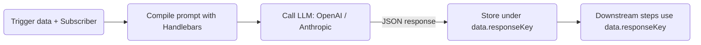
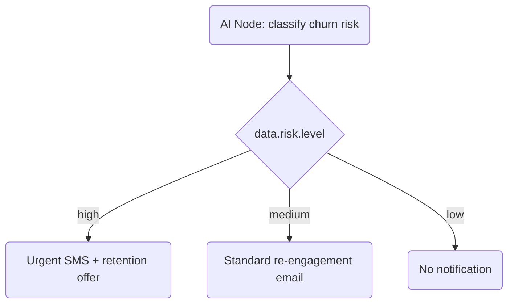

The **AI Node** calls a configured LLM (OpenAI or Anthropic) during workflow execution. The prompt is compiled with the live subscriber + trigger data context, and the response is stored back into `data` for downstream templates and conditions.

<Callout type="info">
  This is **runtime AI in workflows** — for AI-assisted template *authoring* in the dashboard
  editor, see [AI content generation](/docs/platform/features/ai-content).
</Callout>

## How it works



The LLM is instructed via a fixed system prompt to always return a **valid JSON object**. The response is parsed and stored under `data.<responseKey>`.

## Configuration

| Field         | Type   | Required | Description                                                                           |
| :------------ | :----- | :------- | :------------------------------------------------------------------------------------ |
| `prompt`      | string | ✅       | Handlebars template with subscriber + trigger data context                            |
| `responseKey` | string | —        | Key to store the LLM JSON output under `data.*`. Defaults to `ai`                     |
| `conditions`  | object | —        | Optional [step conditions](/docs/platform/features/step-conditions) to gate execution |

<Callout type="info">
  **Default `responseKey`**: If not specified, the LLM response is stored under `data.ai`. The key
  must start with a letter and contain only letters, digits, and underscores
  (`[a-zA-Z][a-zA-Z0-9_]*`).
</Callout>

## Example: personalized subject line

**AI Node prompt:**

```
Write a short email subject line for {{ subscriber.first_name }} about order {{ data.orderId }}.
Tone: friendly, under 60 characters.
Return a JSON object: { "subject": "<subject line here>" }
```

**Downstream email template** (referencing `data.ai.subject`):

```html
Subject: {{ data.ai.subject }}
<p>Hi {{ subscriber.first_name }}, your order {{ data.orderId }} is confirmed!</p>
```

Or with a custom `responseKey: "copy"`:

```html
Subject: {{ data.copy.subject }}
```

## Example: churn-risk branching



**Prompt:**

```
Based on last active date {{ data.lastActiveAt }} and plan {{ data.plan }},
classify this user's churn risk.
Return JSON: { "level": "high" | "medium" | "low", "reason": "<brief reason>" }
```

**Step condition on SMS node** (keyed on `data.risk.level`):

```json
{
  "logic": "AND",
  "rules": [{ "variable": "data.risk.level", "operator": "equals", "value": "high" }]
}
```

## Provider setup

Configure OpenAI or Anthropic API keys in **Integrations → AI Providers** in the dashboard. Token usage is tracked per workflow execution for cost analytics.

- **OpenAI**: Set your `OPENAI_API_KEY` via the dashboard integration
- **Anthropic**: Set your `ANTHROPIC_API_KEY` via the dashboard integration

If no AI provider key is configured, the AI node is skipped and logs `AI_NODE_FAILED` with reason `No AI provider API key configured`.

## Error handling & guardrails

- **No API key configured**: Step skipped, `data.<responseKey>` set to `null`, logs `AI_NODE_FAILED`
- **LLM request timeout**: Step skipped, `data.<responseKey>` set to `null`, logs `AI_NODE_FAILED`
- **Invalid JSON response**: Stored as-is; downstream templates should handle gracefully with `{{#if data.ai}}` guards
- **Cost caps**: Configurable per organization plan tier in dashboard settings

## Workflow-as-code

```ts
import { defineWorkflow } from '@nexus-signal/node';

defineWorkflow('payment.overdue')
  .addHttpFetch({
    url: 'https://api.billing.com/invoices/{{ data.invoiceId }}',
    method: 'GET',
    responseKey: 'invoice',
  })
  .addAiNode({
    prompt:
      'Classify urgency for invoice {{ data.invoice.amount }} due {{ data.invoice.dueDate }}. Return JSON: { "level": "low" | "medium" | "high" }',
    responseKey: 'risk',
  })
  .addChannel('EMAIL')
  .addChannel('SMS', {
    conditions: {
      logic: 'AND',
      rules: [{ variable: 'data.risk.level', operator: 'equals', value: 'high' }],
    },
  })
  .toDefinition();
```

## Related

- [AI content generation](/docs/platform/features/ai-content)
- [Step conditions](/docs/platform/features/step-conditions)
- [HTTP Fetch node](/docs/platform/features/http-fetch-node)
- [Workflow-as-code](/docs/sdk/workflow/workflow-as-code)
