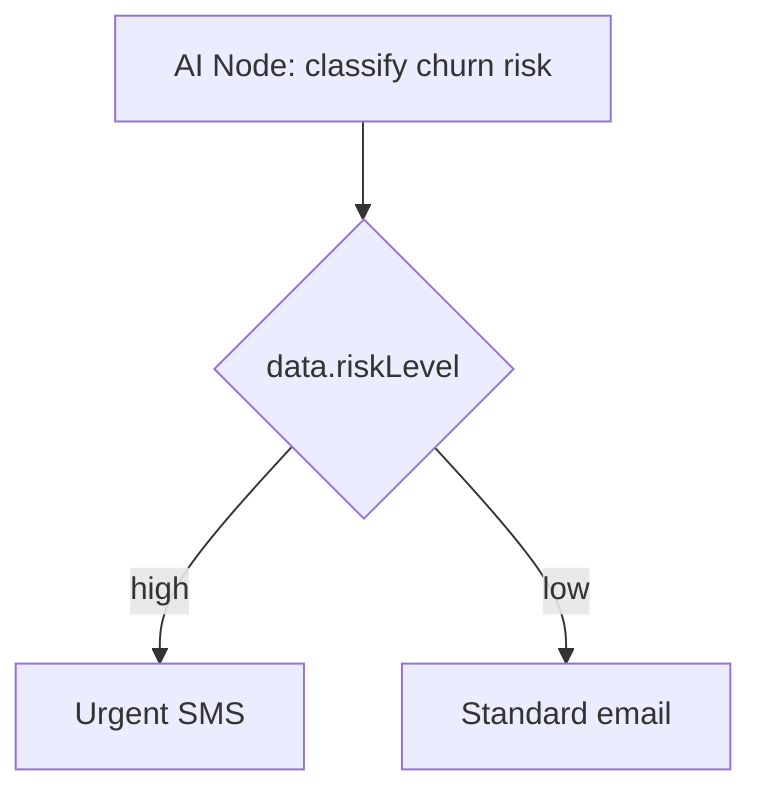

The **AI Node** calls a configured LLM (OpenAI or Anthropic) mid-workflow execution. Use it for dynamic copy, user classification, intent scoring, and non-deterministic branching.

<Callout type="info">
This is **runtime AI in workflows**. For AI-assisted template *authoring* in the dashboard editor, see [AI content generation](/docs/platform/features/ai-content).
</Callout>

## Configuration

| Field | Description |
|-------|-------------|
| `prompt` | Handlebars template with subscriber + trigger context |
| `responseKey` | Key to store LLM output in `ctx.data` (default: `aiResponse`) |
| `conditions` | Optional [step conditions](/docs/platform/features/step-conditions) |

## Example: personalized subject line

Prompt:

```
Write a short email subject line for {{ subscriber.externalId }} about order {{ data.orderId }}.
Tone: friendly, under 60 characters. Return only the subject text.
```

Downstream email channel template:

```html
Subject: {{ aiResponse }}
```

## Example: churn-risk branching



Prompt returns structured context merged via `responseKey`. Attach [step conditions](/docs/platform/features/step-conditions) on downstream nodes keyed on `data.riskLevel`.

## Provider setup

Configure OpenAI or Anthropic API keys in **Integrations → AI Providers**. Token usage is tracked per execution for cost analytics.

## Guardrails

- Request timeout per node
- Fallback path if LLM fails (use conditions on alternate branch)
- Cost caps configurable per organization plan tier

## Related

- [AI content generation](/docs/platform/features/ai-content)
- [Step conditions](/docs/platform/features/step-conditions)
- [HTTP Fetch node](/docs/platform/features/http-fetch-node)
