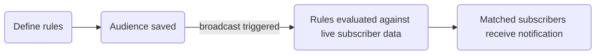

**Audiences** are named, dynamic segments defined by filter rules applied to subscriber fields. Member counts update automatically as subscriber data changes — no manual list maintenance required.

## How audiences work

Audience rules are evaluated **at send time** (when a broadcast is triggered), not at creation time. This means a subscriber who joins your `"growth"` plan today is included in the matching audience when you send tomorrow.



## Filterable fields

Audience rules can filter on the following subscriber fields:

| Field                | Type     | Example values         |
| :------------------- | :------- | :--------------------- |
| `email`              | string   | `"user@example.com"`   |
| `phoneNumber`        | string   | `"+14155552671"`       |
| `locale`             | string   | `"en"`, `"es"`, `"ja"` |
| `timezone`           | string   | `"America/New_York"`   |
| `globalUnsubscribed` | boolean  | `true`, `false`        |
| `externalId`         | string   | `"user_42"`            |
| `createdAt`          | datetime | ISO 8601 string        |

<Callout type="warn">
  Custom subscriber `properties` fields (e.g., `properties.plan`) are **not** directly filterable in
  audience rules. Audience filters are limited to the standard subscriber fields above.
</Callout>

## Supported operators

| Operator                     | Works on                               |
| :--------------------------- | :------------------------------------- |
| `equals` / `not_equals`      | All string, boolean fields             |
| `contains` / `not_contains`  | String fields                          |
| `starts_with` / `ends_with`  | String fields                          |
| `is_empty` / `is_not_empty`  | String fields                          |
| `is_true` / `is_false`       | Boolean fields                         |
| `greater_than` / `less_than` | Date/number fields (e.g., `createdAt`) |

Max 10 rules per audience.

## Create an audience

**Dashboard**: **Audiences** page → **New Audience** → add rules.

**API (Management, `sk_*` key):**

```http
POST /v1/management/audiences
Authorization: Bearer sk_prd_…
Content-Type: application/json
```

```json
{
  "name": "English locale subscribers",
  "description": "Subscribers whose locale is set to English",
  "filters": {
    "logic": "AND",
    "rules": [
      { "field": "locale", "operator": "equals", "value": "en" },
      { "field": "globalUnsubscribed", "operator": "is_false" }
    ]
  }
}
```

**API (Dashboard/Browser, JWT auth):**

```http
POST /v1/audiences
Authorization: Bearer <jwt_token>
```

## Preview members

The dashboard shows a **live member count** as you edit rules. You can also fetch members via API:

```http
GET /v1/audiences/:id/members?page=1&limit=50
Authorization: Bearer <jwt_token>
```

Returns paginated subscriber list matching current rules.

## Use in broadcasts

Audiences are used as the recipient target for [Broadcasts](/docs/platform/features/broadcasts):

```json
{
  "name": "English User Re-engagement",
  "workflowId": "<workflow-uuid>",
  "audienceId": "<audience-uuid>",
  "scheduledAt": "2026-09-01T09:00:00Z"
}
```

<Callout type="info">
  A broadcast **must** have an `audienceId` assigned before it can be sent. Attempting to send a
  broadcast without an audience returns a `400` error.
</Callout>

## Limits

| Limit                         | Value |
| :---------------------------- | :---- |
| Max audiences per environment | 50    |
| Max rules per audience        | 10    |

## Related

- [Broadcasts](/docs/platform/features/broadcasts)
- [Audiences API](/docs/api/audiences)
- [Subscribers API](/docs/api/subscribers)
