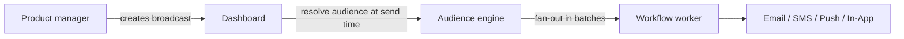

**Broadcasts** let product and marketing teams send announcements, feature launches, and maintenance notices from the dashboard — without any code changes. They use [Audiences](/docs/platform/features/audiences) as their recipient target and execute any existing workflow.

## How broadcasts differ from triggers

|              | Event trigger                   | Broadcast                               |
| :----------- | :------------------------------ | :-------------------------------------- |
| Initiated by | Your backend code               | Dashboard or Management API             |
| Recipients   | Explicit subscribers or objects | Audience segment (required)             |
| Timing       | Immediate (async 202)           | Immediate or scheduled                  |
| Use case     | Transactional, event-driven     | Announcements, campaigns, re-engagement |



## Broadcast lifecycle

| Status      | Meaning                                                                 |
| :---------- | :---------------------------------------------------------------------- |
| `DRAFT`     | Composed, not yet sent. Can be edited or deleted.                       |
| `SCHEDULED` | Queued for a future `scheduledAt` time. Can be cancelled or edited.     |
| `SENDING`   | Fan-out in progress. Cannot be edited or deleted.                       |
| `COMPLETED` | All recipients processed. Partial failures still result in `COMPLETED`. |
| `FAILED`    | All recipient batches failed.                                           |
| `CANCELLED` | Manually cancelled by a user (from `SCHEDULED` or `SENDING`).           |

<Callout type="info">
  Broadcasts are permanently switched to `FAILED` only when **all** recipients fail. If even one
  recipient is delivered, the status is `COMPLETED`.
</Callout>

## Create a broadcast

**Dashboard**: **Broadcasts** → **New Broadcast** → select workflow + audience → set schedule.

**Management API (`sk_*` key — for server-side automation):**

```http
POST /v1/management/broadcasts
Authorization: Bearer sk_prd_…
Content-Type: application/json
```

```json
{
  "name": "Q4 Product Update",
  "workflowId": "<workflow-uuid>",
  "audienceId": "<audience-uuid>",
  "data": { "version": "4.0", "changelogUrl": "https://blog.example.com/q4" },
  "scheduledAt": "2026-08-01T09:00:00Z"
}
```

Omit `scheduledAt` to create as `DRAFT` (send manually later). Include it to immediately set status to `SCHEDULED`.

**Dashboard API (JWT auth — for frontend integrations):**

```http
POST /v1/broadcasts
Authorization: Bearer <jwt_token>
```

## Send immediately

Send a `DRAFT` or `SCHEDULED` broadcast now:

```http
POST /v1/management/broadcasts/:id/send
Authorization: Bearer sk_prd_…
```

Or via dashboard: open the broadcast detail → **Send Now**.

## Cancel a broadcast

```http
POST /v1/management/broadcasts/:id/cancel
Authorization: Bearer sk_prd_…
```

Only `SCHEDULED` or `SENDING` broadcasts can be cancelled.

## Passing data to the workflow

The `data` field on a broadcast is passed as trigger payload to the workflow for every recipient. Use this for dynamic content like changelogs, URLs, or promo codes:

```json
{
  "data": {
    "promoCode": "LAUNCH40",
    "expiresAt": "2026-09-01"
  }
}
```

In your workflow email template: `{{ data.promoCode }}`, `{{ data.expiresAt }}`.

## Analytics

Per-broadcast delivery, open, and click stats appear in the dashboard broadcast detail view after sending:

- `totalRecipients` — audience size at send time
- `deliveredCount` — successfully accepted by provider
- `failedCount` — provider rejections or processing errors

## Limits

| Limit                              | Value                     |
| :--------------------------------- | :------------------------ |
| Max broadcasts per environment     | 200                       |
| Fan-out batch size                 | 100 subscribers per batch |
| Scheduled broadcast check interval | Every 60 seconds          |

## Related

- [First broadcast guide](/docs/platform/guides/first-broadcast)
- [Audiences](/docs/platform/features/audiences)
- [Broadcasts API](/docs/api/broadcasts)
