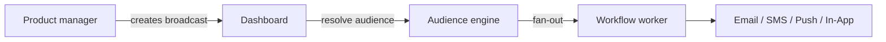

**Broadcasts** let product and marketing teams send announcements, feature launches, and maintenance notices from the dashboard without code changes.

## How broadcasts differ from triggers

| | Event trigger | Broadcast |
|---|---------------|-----------|
| Initiated by | Your backend code | Dashboard or Management API |
| Recipients | Explicit list or objects | Audience segment |
| Use case | Transactional, event-driven | Announcements, campaigns |



## Create a broadcast

Dashboard: **Broadcasts** → compose workflow + audience + schedule.

Management API (uses `sk_*` key):

```http
POST /v1/management/broadcasts
Authorization: Bearer sk_prd_…
```

```json
{
  "name": "Q4 Product Update",
  "workflowId": "uuid",
  "audienceId": "uuid",
  "scheduledAt": "2026-08-01T09:00:00Z"
}
```

Send immediately:

```http
POST /v1/management/broadcasts/:id/send
```

Dashboard users can also create via `POST /v1/broadcasts` with JWT auth — see [Broadcasts API](/docs/api/broadcasts).

## Broadcast lifecycle

| Status | Meaning |
|--------|---------|
| `DRAFT` | Composed, not sent |
| `SCHEDULED` | Queued for future send |
| `SENDING` | Fan-out in progress |
| `COMPLETED` | All recipients processed |
| `FAILED` / `CANCELLED` | Error or user cancelled |

## Analytics

Per-broadcast delivery, open, and click stats appear in the dashboard broadcast detail view.

## Related

- [First broadcast guide](/docs/platform/guides/first-broadcast)
- [Audiences](/docs/platform/features/audiences)
- [Broadcasts API](/docs/api/broadcasts)
