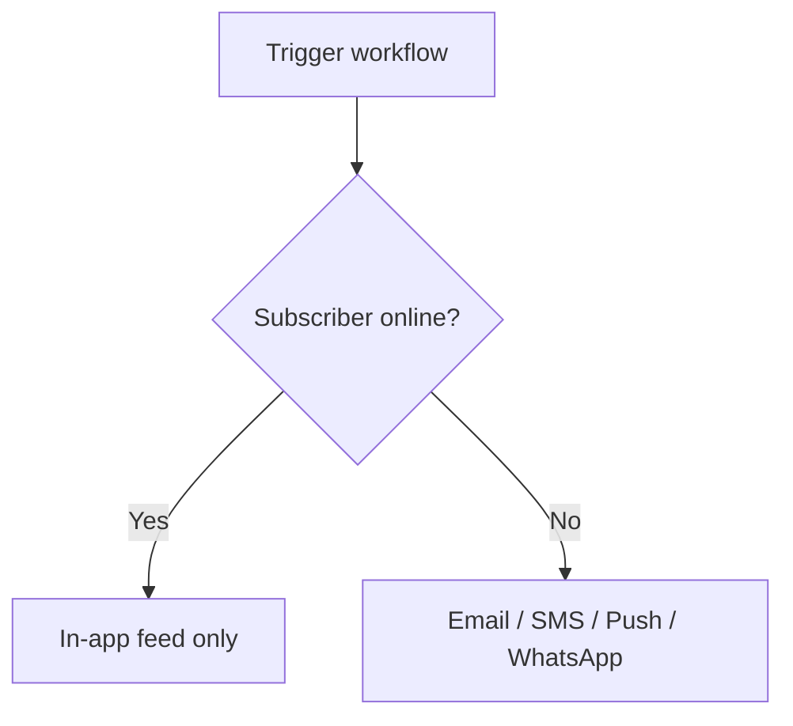

Nexus includes built-in cost-control mechanisms designed to prune unnecessary notification spend automatically.

## Presence suppression

Sending multiple external alerts (SMS, push) when a user is already actively using your application is both annoying to the user and a waste of provider budget.

When a subscriber has an active client SDK connection (React, Angular, or Headless JS), Nexus flags them as **online** and suppresses outbound external channels, routing the notification to the **in-app inbox only**.



### Suppressible channels

By default, the following channels are suppressed if the subscriber is active:

- Mobile Push (`MOBILE_PUSH`)
- Web Push (`WEB_PUSH`)
- SMS (`SMS`)
- WhatsApp (`WHATSAPP`)

In-app notifications are never suppressed and always deliver via the WebSocket connection.

### How presence is tracked

1. The client-side SDK opens a WebSocket connection and issues a heartbeat ping to `/realtime` every **40 seconds**.
2. Redis stores the connection key `presence:sub:<subscriberId>` with a strict **45-second Time-To-Live (TTL)**.
3. Before dispatching a suppressible step, the workflow worker queries Redis. If the key exists, the step is skipped.
4. Suppressed executions are logged under the `PRESENCE_SUPPRESSION` lifecycle step with status `SKIPPED_BY_PREFERENCE`.

<Callout type="info">
  You can toggle this per channel step in the workflow editor using the **Suppress when subscriber
  is online** checkbox, or in workflow-as-code by setting `suppressWhenOnline` in options.
</Callout>

## Sandbox mode (Development)

Testing notification workflows with real providers (e.g., Twilio, SendGrid) incurs transactional costs and risks sending garbage text to real users.

In the **Development** environment, Nexus isolates all external channels using a virtual **Sandbox Simulator**. Outbound API calls are mocked, and the generated content, payloads, and rendering results are stored directly in your development logs.

- Preview exact emails, SMS payloads, and WhatsApp JSON formats in the dashboard.
- Zero API credentials required for testing.
- See [Sandbox mode](/docs/platform/features/sandbox) for setup.

## Weighted provider routing

Spread delivery traffic across multiple providers in the same channel layer (e.g. 70% SendGrid, 30% Resend). This is useful for:

- Splitting spend between providers.
- Gradual provider migration.
- Risk distribution.

**Update routing weights via API:**

```http
PUT /v1/integrations/weights/:layer
Authorization: Bearer <jwt_dashboard_token>
Content-Type: application/json

{
  "weights": {
    "sendgrid": 70,
    "resend": 30
  }
}
```

- `:layer`: Must be one of `email`, `sms`, `whatsapp`, `push`, `webhook`, `slack`, `discord`, or `ms_teams`.
- **Constraint**: The sum of all provider weights in a layer **must equal exactly 100**.

## Circuit breaker failover

When a provider endpoint repeatedly rejects requests (5 consecutive errors within a 60-second window), the provider's circuit breaker opens (`OPEN` state). Traffic is automatically rerouted to alternative providers in the layer, preventing wasted retries on dead API endpoints.

## Related

- [Smart send-time](/docs/platform/features/smart-send-time) — timing optimization
- [Cost analytics](/docs/platform/features/cost-analytics) — measuring savings
- [Digest & throttle](/docs/platform/features/digest-throttle) — debouncing rules
