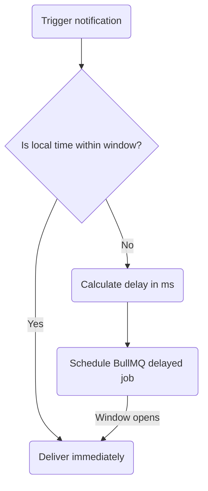

The **Delivery Window** step checks the subscriber's local time before dispatching downstream notifications. If the current time is outside the allowed window (e.g., in the middle of the night), Nexus pauses execution and schedules a delayed job to resume when the window opens.



## Configuration

When defining a Delivery Window node in the canvas or via workflow-as-code, specify the following parameters:

| Field         | Type    | Required | Description                                                                               |
| :------------ | :------ | :------- | :---------------------------------------------------------------------------------------- |
| `windowStart` | string  | ✅       | Start time in `HH:MM` format (24-hour, e.g., `"09:00"`)                                   |
| `windowEnd`   | string  | ✅       | End time in `HH:MM` format (24-hour, e.g., `"21:00"`)                                     |
| `urgent`      | boolean | —        | Set `true` to completely bypass the window check for critical alerts. Defaults to `false` |

## How subscriber timezone is resolved

The subscriber's local time is determined in the following priority order:

1. The `timezone` property passed on the subscriber object at trigger time:
   ```ts
   recipients: [{ externalId: 'user_42', timezone: 'America/New_York' }];
   ```
2. The `timezone` stored on the subscriber's profile in the database.
3. Fallback to **`UTC`** if no timezone is resolved or if the provided string is not a valid IANA identifier.

## Execution states & lifecycle

The delivery window step logs the following lifecycle events in the execution log tree:

### 1. Delivery window hold (`DELIVERY_WINDOW_HOLD`)

If the user's local time is outside the allowed window:

- Status changes to `QUEUED`.
- BullMQ schedules a delayed job with `jobId: "deliveryWindow:<logId>:<nodeId>"` and a custom millisecond delay.
- Logs metadata showing:
  - `subscriberLocalTime`
  - `delayMs` (milliseconds until the window opens)
  - `resumeNodeId` (the next step in the flow)

### 2. Delivery window pass (`DELIVERY_WINDOW_PASS`)

If the user's local time is inside the allowed window, or if `urgent` is set to `true`:

- Status remains `PROCESSING` (runs immediately).
- Logs `reason: "within_window"` or `reason: "urgent_bypass"`.

## Workflow-as-code example

```ts
import { defineWorkflow } from '@nexus-signal/node';

defineWorkflow('invoice.overdue')
  .addDeliveryWindow({
    windowStart: '09:00',
    windowEnd: '18:00',
    urgent: false,
  })
  .addChannel('SMS')
  .toDefinition();
```

## Related

- [Smart send-time](/docs/platform/features/smart-send-time) — optimizes _which_ hour; delivery window sets _allowed_ hours
- [Subscribers API](/docs/api/subscribers) — setting user timezones
- [Workflow-as-code](/docs/sdk/workflow/workflow-as-code)
