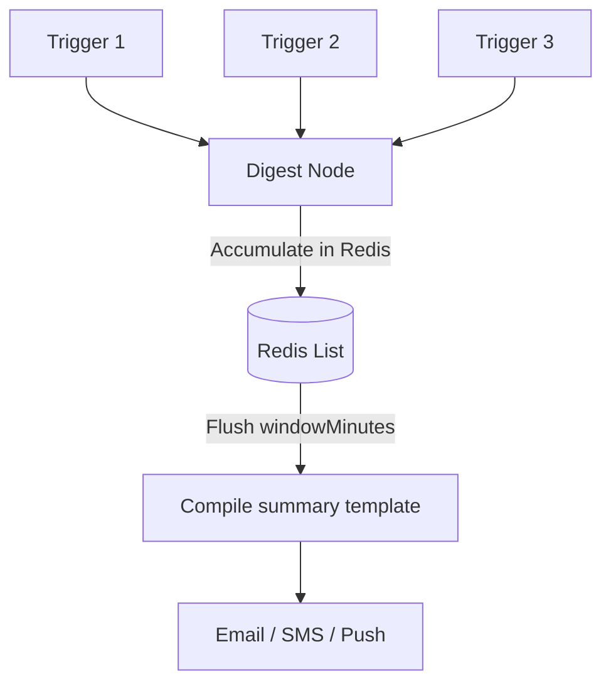
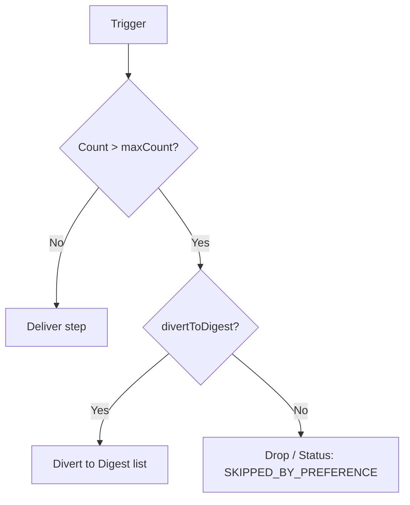

Nexus includes built-in state management for **collapsing noisy notifications** (Digest) and **capping message rates** (Throttle) at the subscriber level, using Redis as the real-time coordinator.

---

## Digest node

The **Digest** node intercepts workflow execution, pushes the trigger context into a Redis list, and delays downstream dispatching. When the configured timer expires, Nexus flushes the Redis list and dispatches a single notification containing all grouped events.



### Configuration

| Field           | Type   | Default | Description                                                                   |
| :-------------- | :----- | :------ | :---------------------------------------------------------------------------- |
| `windowMinutes` | number | `30`    | The sliding window size in minutes to collect trigger events before flushing. |

### How it works

1. When a trigger reaches the digest node, the worker pushes `{ logId, at, data }` into the Redis key `digest:<workflowId>:<subscriberId>:<nodeId>`.
2. The log status is set to `QUEUED_IN_DIGEST` and execution is deferred (`deferred: true`). The lifecycle registers `DIGEST_HELD`.
3. A delayed BullMQ job is scheduled with `jobId: "digest:<workflowId>:<nodeId>"` corresponding to `windowMinutes`.
4. When the job fires, it flushes the list, updates the lifecycle to `DIGEST_FLUSH`, and injects a consolidated `digest` object into the Handlebars context:

```json
{
  "digest": {
    "count": 3,
    "items": [
      { "logId": "log-1", "at": "2026-07-28T21:00:00Z", "data": { "comment": "Nice post!" } },
      { "logId": "log-2", "at": "2026-07-28T21:01:00Z", "data": { "comment": "Love this!" } }
    ],
    "nodeId": "digest-node-id",
    "windowMinutes": 30
  }
}
```

### Summary template formatting

In your downstream email or push channel template, you loop through `digest.items` using the `{{#each}}` Handlebars helper:

```html
<h3>You have {{ digest.count }} new updates</h3>
<ul>
  {{#each digest.items}}
  <li>On {{ at }}: {{ data.comment }}</li>
  {{/each}}
</ul>
```

---

## Throttle node

The **Throttle** node rate-limits notifications by tracking delivery frequency in Redis. If a subscriber receives more than `maxCount` messages within `windowSeconds`, overflow messages are either discarded or diverted into a digest.



### Configuration

| Field            | Type    | Default | Description                                                                |
| :--------------- | :------ | :------ | :------------------------------------------------------------------------- |
| `maxCount`       | number  | `3`     | Maximum allowed notifications in the window.                               |
| `windowSeconds`  | number  | `60`    | Duration of the rate limit window in seconds.                              |
| `divertToDigest` | boolean | `false` | If `true`, throttled overflow is batched into a digest instead of dropped. |

### How it works

1. Each execution increments the Redis throttle count key. On the first increment, the key is set to expire in `windowSeconds`.
2. **Under limit**: Execution logs `THROTTLE_PASS` and continues immediately.
3. **Over limit**:
   - **`divertToDigest: false`**: The execution is dropped. The log status is set to `SKIPPED_BY_PREFERENCE` and logs a `THROTTLE_LIMIT` lifecycle step.
   - **`divertToDigest: true`**: The execution is routed to a Redis digest list. The log status changes to `QUEUED_IN_DIGEST` and logs `DIGEST_HELD`. A BullMQ job is scheduled with `jobId: "throttle-digest:<workflowId>:<nodeId>"` to flush the digest when the window expires.

## Workflow-as-code example

```ts
import { defineWorkflow } from '@nexus-signal/node';

// Regular digest workflow
defineWorkflow('comments.digest')
  .addDigest({ windowMinutes: 15 })
  .addChannel('EMAIL')
  .toDefinition();

// Throttle workflow with overflow diversion
defineWorkflow('payment.alerts')
  .addThrottle({
    maxCount: 2,
    windowSeconds: 300,
    divertToDigest: true,
  })
  .addChannel('SMS')
  .toDefinition();
```

## Related

- [Workflows](/docs/platform/concepts/workflows)
- [Delivery pipeline](/docs/platform/concepts/delivery-pipeline)
- [Workflow-as-code](/docs/sdk/workflow/workflow-as-code)
