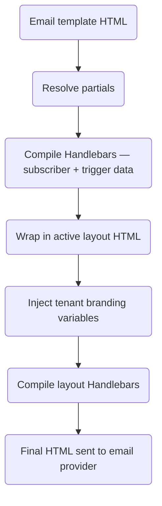

**Email layouts** wrap all email templates in a shared HTML frame (header, footer, styles). **Partials** are reusable Handlebars snippets that can be referenced across multiple templates. Together they let you maintain a consistent brand without duplicating HTML.

## Email layouts

A layout defines the outer HTML shell. The compiled template body is injected at `{{{ content }}}`:

```html
<!DOCTYPE html>
<html>
  <head>
    <meta charset="utf-8" />
    <style>
      /* your base styles */
    </style>
  </head>
  <body>
    <header>
      
    </header>
    <main>{{{ content }}}</main>
    <footer>{{{ footerHtml }}}</footer>
  </body>
</html>
```

<Callout type="info">
Use triple braces `{{{ content }}}` and `{{{ footerHtml }}}` to render HTML without escaping. Use double braces `{{ logo }}` for URL strings and other scalar values.
</Callout>

### Tenant branding variables in layouts

When a workflow trigger includes a `tenant` value, the tenant's branding fields are injected directly into the layout context by their field names:

| Layout variable      | Source                         |
| :------------------- | :----------------------------- |
| `{{ logo }}`         | `tenant.branding.logo`         |
| `{{ primaryColor }}` | `tenant.branding.primaryColor` |
| `{{{ footerHtml }}}` | `tenant.branding.footerHtml`   |
| `{{ name }}`         | `tenant.name`                  |

If no tenant is set on the trigger, these variables are empty and your layout should include sensible fallbacks.

### Layout variables

Beyond tenant branding, you can define **custom static variables** on a layout itself (key-value pairs in the dashboard). These are merged into the context alongside tenant branding and subscriber data.

## Partials

Partials are reusable HTML snippets registered by name. Create them in **Templates → Partials**:

```html
<!-- partial name: cta-button -->
<a
  href="{{ url }}"
  style="display:inline-block; padding:12px 24px;
   background-color:{{ primaryColor }}; color:#fff; text-decoration:none;
   border-radius:4px;"
  >{{ label }}</a
>
```

Reference in any email template or layout with:

```html
{{> cta-button url=data.checkoutUrl label="Complete purchase" }}
```

Change the partial once — every template using it updates on the next send.

## Compilation order



## Assigning a layout to a workflow

In the dashboard **Workflow canvas**:

1. Open workflow settings
2. Select **Email Layout** — choose from layouts in the current environment
3. Save — the layout applies to all email channel steps in that workflow

A single layout can be active across multiple workflows. Changing the layout HTML updates all workflows using it on their next send.

## Related

- [Per-tenant branding](/docs/platform/features/tenants)
- [Email layouts API](/docs/api/email-layouts)
- [Multi-language templates](/docs/platform/features/i18n)
