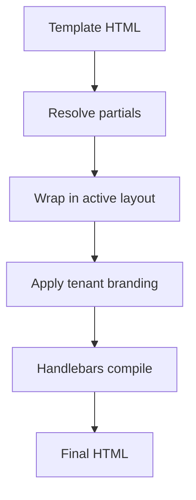

**Email layouts** wrap all email templates in a shared HTML frame (header, footer, styles). **Partials** are reusable Handlebars snippets referenced across templates.

## Layouts

Layouts define the outer shell with a content slot:

```html
<!DOCTYPE html>
<html>
  <body>
    
    <div class="content">{{{ content }}}</div>
    <footer>{{ branding.footerHtml }}</footer>
  </body>
</html>
```

Dashboard: **Templates → Layouts**. One layout can be marked active per environment. Tenant branding variables inject automatically when a tenant context is set.

## Partials

Create reusable blocks in **Templates → Partials**:

```html
<!-- partial: cta-button -->
<a href="{{ url }}" class="btn btn-primary">{{ label }}</a>
```

Reference in any email template:

```html
{{> cta-button url=data.checkoutUrl label="Complete purchase" }}
```

Change the partial once — every template using it updates on next send.

## Compilation order



## Related

- [Per-tenant branding](/docs/platform/features/tenants)
- [Email layouts API](/docs/api/email-layouts)
- [Multi-language templates](/docs/platform/features/i18n)
