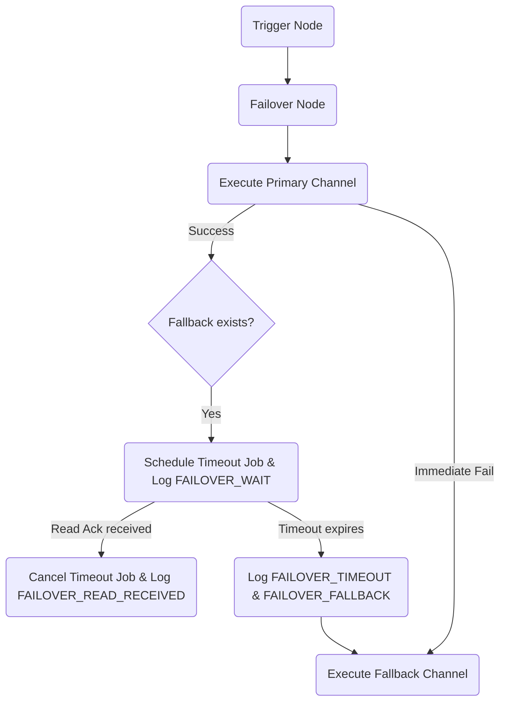

The **Failover** node guarantees critical alerts reach your subscribers by executing fallback channel branches. Failover operates in two modes: **immediate failover** on provider failure and **time-delayed failover** if a message remains unread.

## Configuration

When configuring a Failover node, specify the following parameters:

| Field             | Type   | Required | Default | Description                                                                        |
| :---------------- | :----- | :------- | :------ | :--------------------------------------------------------------------------------- |
| `primaryChannel`  | string | ✅       | —       | Primary channel (e.g. `MOBILE_PUSH`, `EMAIL`)                                      |
| `fallbackChannel` | string | —        | —       | Backup channel to use if primary fails or is unread (e.g. `SMS`)                   |
| `timeoutSeconds`  | number | —        | `120`   | Seconds to wait for a read acknowledgment before triggering fallback (10 to 3600). |

## Execution paths

### 1. Immediate failover (Provider outage)

If dispatching the primary channel fails (e.g. invalid email address or provider error) or if the primary provider's [circuit breaker](/docs/platform/features/cost-reduction) is open:

- Nexus logs the failure under the `FAILOVER_PRIMARY` lifecycle step.
- If the circuit was open, the status is set to `FAILED_PROVIDER_DOWN` with error `provider_down`.
- Nexus immediately bypasses the delay and executes the `fallbackChannel` step, logging `FAILOVER_FALLBACK` with reason `circuit_open_primary` or `primary_failed`.

### 2. Time-delayed failover (Unread alerts)

If the primary channel dispatches successfully, but a fallback is configured:

1. **Schedule Watch**: Nexus schedules a delayed BullMQ job `failover:<logId>:<nodeId>` with a delay of `timeoutSeconds`.
2. **Write Redis Metadata**: Watch parameters are stored in Redis under the key `failover:meta:<logId>` (with a TTL of `timeoutSeconds + 60`).
3. **Log WAIT**: The execution logs a `FAILOVER_WAIT` lifecycle step and sets the log status to `QUEUED`.
4. **Resolution**:
   - **Case A: User reads the message**: If the user opens or reads the message before the timeout, the WebSocket/SDK read event invokes `acknowledgeFailoverWatch`. This removes the delayed BullMQ job, clears the Redis metadata, logs `FAILOVER_READ_RECEIVED`, and resumes downstream execution immediately.
   - **Case B: Timeout expires**: If the timeout expires without a read acknowledgment (`READ` or `OPENED` status), the worker logs `FAILOVER_TIMEOUT` and `FAILOVER_FALLBACK` (reason: `read_timeout`), then dispatches the `fallbackChannel`.

## Chaos mode testing

To test your failover paths without waiting for real provider outages:

1. Navigate to **Integrations** in the dashboard.
2. Enable **Chaos Mode** on the primary provider.
3. Trigger a workflow. The provider will mock a failure, and you can watch the immediate failover execute in the dashboard audit log.

## Related

- [Cost reduction & circuit breakers](/docs/platform/features/cost-reduction)
- [Sandbox simulator](/docs/platform/features/sandbox)
- [Workflow-as-code](/docs/sdk/workflow/workflow-as-code)
