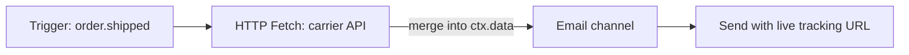

The **HTTP Fetch** node makes an HTTP request during workflow execution and merges the response into the workflow context for downstream steps.

## Why fetch at send time

Without HTTP Fetch, all data must be passed at trigger time. That leads to stale values (tracking URLs that change) or bloated payloads. Fetch live data when the notification actually sends.



## Configuration

| Field         | Description                                                                              |
| ------------- | ---------------------------------------------------------------------------------------- |
| `url`         | Request URL — supports Handlebars: `https://api.carrier.com/track/{{ data.trackingId }}` |
| `method`      | `GET` or `POST`                                                                          |
| `headers`     | Optional key-value header pairs                                                          |
| `body`        | POST body template (Handlebars)                                                          |
| `responseKey` | Context key to store parsed JSON (default: merged into `data`)                           |

## Example

Fetch latest shipment status before email:

```
URL:    https://api.shipping.com/v1/shipments/{{ data.shipmentId }}
Method: GET
responseKey: shipment
```

Email template:

```html
<p>Status: {{ shipment.status }}</p>
<a href="{{ shipment.trackingUrl }}">Track package</a>
```

## Error handling

- Configurable timeout (worker default)
- Failed fetches log in execution lifecycle; configure fallback paths with [step conditions](/docs/platform/features/step-conditions) or failover nodes
- Domain allowlist per environment (security)

## Workflow-as-code

```ts
import { defineWorkflow } from "@nexus-signal/node";

defineWorkflow("order.shipped")
  .addHttpFetch({
    url: "https://api.carrier.com/track/{{ data.trackingId }}",
    method: "GET",
    responseKey: "tracking",
  })
  .addChannel("EMAIL");
```

## Related

- [Workflows](/docs/platform/concepts/workflows)
- [Workflow-as-code](/docs/sdk/workflow/workflow-as-code)
