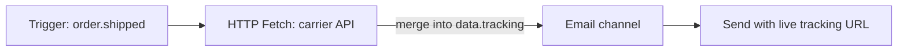

The **HTTP Fetch** node makes an outbound HTTP request during workflow execution and merges the JSON response into the workflow's `data` context. Downstream steps — templates, conditions, and AI nodes — can then reference the fetched data as `{{ data.<responseKey>.<field> }}`.

## Why fetch at send time

Passing all data at trigger time has limitations:

- Tracking URLs may change between trigger and delivery
- Order status may update in the seconds between API call and notification send
- Bloated trigger payloads with data that may never be used

HTTP Fetch solves this by pulling live data exactly when the notification is being assembled.



## Configuration

| Field         | Type             | Required | Description                                                                              |
| :------------ | :--------------- | :------- | :--------------------------------------------------------------------------------------- |
| `url`         | string           | ✅       | Request URL — supports Handlebars: `https://api.carrier.com/track/{{ data.trackingId }}` |
| `method`      | `GET` \| `POST`  | —        | HTTP method. Defaults to `GET`                                                           |
| `headers`     | `{key, value}[]` | —        | Optional key-value header pairs. Supports Handlebars in both key and value               |
| `body`        | string           | —        | POST body template (Handlebars). Only sent for `POST` requests                           |
| `responseKey` | string           | —        | Context key name to store parsed JSON response under `data.*`. Defaults to `fetched`     |

<Callout type="info">
  **Default `responseKey`**: If you don't specify a `responseKey`, the response is stored under
  `data.fetched`. The key must start with a letter and contain only letters, digits, and
  underscores.
</Callout>

## Limits

| Property               | Value            |
| :--------------------- | :--------------- |
| Request timeout        | 10 seconds       |
| Max response size      | 50 KB            |
| Max request URL length | 2,048 characters |
| Max custom headers     | 10               |
| Max request body size  | 10 KB            |

## Example: fetch live shipment status

**Node configuration:**

```
URL:         https://api.shipping.com/v1/shipments/{{ data.shipmentId }}
Method:      GET
responseKey: shipment
```

**Email template** (downstream step):

```html
<p>Status: {{ data.shipment.status }}</p>
<a href="{{ data.shipment.trackingUrl }}">Track your package →</a>
```

<Callout type="warn">
The fetched data is always available as `data.<responseKey>` — not directly as `{{ responseKey }}`. This is because all trigger data, including HTTP Fetch results, is stored under the `data` namespace in the template context.
</Callout>

## Error handling

- If the request **times out** after 10 seconds, execution continues with `data.<responseKey>` set to `null`
- If the response body **cannot be parsed as JSON**, it is stored as `{ "_raw": "<text content>" }`
- Failed fetches log `HTTP_FETCH_FAILED` in the execution lifecycle; configure fallback paths with [step conditions](/docs/platform/features/step-conditions)
- **Domain allowlisting** is available per environment for security-conscious setups

## Workflow-as-code

```ts
import { defineWorkflow } from '@nexus-signal/node';

defineWorkflow('order.shipped')
  .addHttpFetch({
    url: 'https://api.carrier.com/track/{{ data.trackingId }}',
    method: 'GET',
    responseKey: 'tracking',
  })
  .addChannel('EMAIL')
  .toDefinition();
```

The email template for this workflow can then reference `{{ data.tracking.estimatedDelivery }}`, `{{ data.tracking.status }}`, etc.

## Conditional branching on fetched data

Use [step conditions](/docs/platform/features/step-conditions) on a downstream node to branch on the fetched result:

```json
{
  "logic": "AND",
  "rules": [{ "variable": "data.tracking.status", "operator": "equals", "value": "DELAYED" }]
}
```

Attach this to an SMS node to only send a delay alert when the carrier reports a delay.

## Related

- [Workflows](/docs/platform/concepts/workflows)
- [Step conditions](/docs/platform/features/step-conditions)
- [AI workflow node](/docs/platform/features/ai-workflow-node)
- [Workflow-as-code](/docs/sdk/workflow/workflow-as-code)
