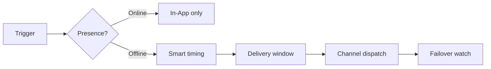

<Cards>
  <Card title="Cost reduction" href="/docs/platform/features/cost-reduction" description="Presence suppression, sandbox, weighted routing." />
  <Card title="Smart send-time" href="/docs/platform/features/smart-send-time" description="AI peak-hour delivery per subscriber." />
  <Card title="AI content" href="/docs/platform/features/ai-content" description="Generate copy for all channels from one prompt." />
  <Card title="Cost analytics" href="/docs/platform/features/cost-analytics" description="Spend tracking and budget alerts." />
  <Card title="Delivery windows" href="/docs/platform/features/delivery-windows" description="Timezone-aware quiet hours." />
  <Card title="i18n templates" href="/docs/platform/features/i18n" description="Multi-language from one workflow." />
  <Card title="Digest & throttle" href="/docs/platform/features/digest-throttle" description="Batch alerts, rate limits." />
  <Card title="Failover" href="/docs/platform/features/failover" description="Automatic channel fallback." />
  <Card title="Topics" href="/docs/platform/features/topics" description="Category-based subscriptions." />
  <Card title="Schedules" href="/docs/platform/features/schedules" description="Cron and one-shot triggers." />
  <Card title="Sandbox" href="/docs/platform/features/sandbox" description="Test without real provider spend." />
</Cards>

## Nexus vs typical platforms

| Feature | Nexus | Typical infra |
|---------|-------|---------------|
| Presence suppression | Yes | Rare |
| AI smart send-time | Yes | Rare |
| Provider cost analytics | Yes | No |
| BYOP zero markup | Yes | Often bundled |
| AI content generation | Yes | No |

## How features connect

