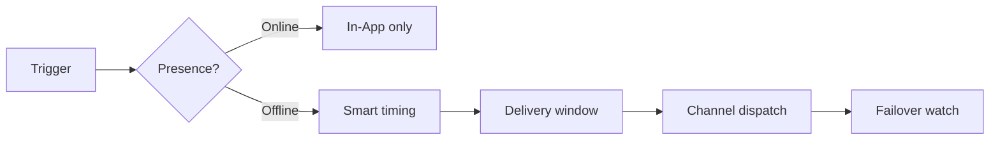

## Delivery & reliability

<Cards>
  <Card title="Cost reduction" href="/docs/platform/features/cost-reduction" description="Presence suppression, sandbox, weighted routing." />
  <Card title="Smart send-time" href="/docs/platform/features/smart-send-time" description="AI peak-hour delivery per subscriber." />
  <Card title="Delivery windows" href="/docs/platform/features/delivery-windows" description="Timezone-aware quiet hours." />
  <Card title="Digest & throttle" href="/docs/platform/features/digest-throttle" description="Batch alerts, rate limits." />
  <Card title="Failover" href="/docs/platform/features/failover" description="Automatic channel fallback." />
  <Card title="Sandbox" href="/docs/platform/features/sandbox" description="Test without real provider spend." />
</Cards>

## Workflow intelligence

<Cards>
  <Card title="Step conditions" href="/docs/platform/features/step-conditions" description="Boolean rules on any workflow node." />
  <Card title="HTTP Fetch node" href="/docs/platform/features/http-fetch-node" description="Live API data mid-workflow." />
  <Card title="AI workflow node" href="/docs/platform/features/ai-workflow-node" description="Runtime LLM classification and copy." />
  <Card title="AI content" href="/docs/platform/features/ai-content" description="Generate template copy from a prompt." />
</Cards>

## Product messaging

<Cards>
  <Card title="Objects & subscriptions" href="/docs/platform/features/objects-subscriptions" description="Fan-out to everyone watching an entity." />
  <Card title="Audiences" href="/docs/platform/features/audiences" description="Dynamic subscriber segments." />
  <Card title="Broadcasts" href="/docs/platform/features/broadcasts" description="One-time sends from the dashboard." />
  <Card title="In-product guides" href="/docs/platform/features/guides" description="Banners, modals, tooltips." />
  <Card title="Per-tenant branding" href="/docs/platform/features/tenants" description="White-label for B2B SaaS customers." />
  <Card title="Rich inbox" href="/docs/platform/features/rich-inbox" description="Tabs, actions, actors, tag filters." />
</Cards>

## Content & localization

<Cards>
  <Card title="Translation files" href="/docs/platform/features/translations" description="{{ t 'key' }} shared locale strings." />
  <Card title="Email layouts & partials" href="/docs/platform/features/email-layouts" description="Shared frames and reusable HTML blocks." />
  <Card title="Multi-language templates" href="/docs/platform/features/i18n" description="Locale variants per channel." />
</Cards>

## Organization & analytics

<Cards>
  <Card title="Topics" href="/docs/platform/features/topics" description="Category-based preference groups." />
  <Card title="Schedules" href="/docs/platform/features/schedules" description="Cron and one-shot triggers." />
  <Card title="Cost analytics" href="/docs/platform/features/cost-analytics" description="Spend tracking and budget alerts." />
</Cards>

## Nexus vs typical platforms

| Feature | Nexus | Typical infra |
|---------|-------|---------------|
| Object fan-out | Yes | Rare |
| Dashboard broadcasts | Yes | Enterprise-only |
| HTTP Fetch / AI nodes | Yes | Rare |
| Per-tenant branding | Yes | Enterprise-only |
| MCP + CLI | Yes | New in 2025+ |
| BYOP zero markup | Yes | Often bundled |

## How features connect

```mermaid
flowchart LR
  T[Trigger] --> P{Presence?}
  P -->|Online| I[In-App only]
  P -->|Offline| S[Smart timing]
  S --> W[Delivery window]
  W --> C[Channel dispatch]
  C --> F[Failover watch]
```
