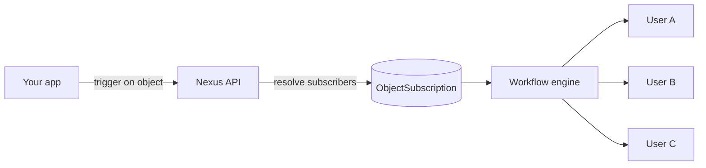

**Objects** are first-class entities (projects, documents, orders, channels) that users subscribe to. Trigger a workflow with an object recipient and Nexus fans out to all subscribers automatically.

## Why objects matter

Without objects, every trigger requires your backend to query "who is watching this?" and pass a full recipient list. Objects move that relationship into Nexus.



## Create an object

Dashboard: **Objects** page, or API/SDK:

```ts
await nexus.objects.set({
  collection: 'projects',
  externalId: 'proj_alpha',
  name: 'Project Alpha',
  properties: { status: 'active', owner: 'team-eng' },
});
```

Object properties are available in templates as `{{ object.name }}`, `{{ object.properties.status }}`.

## Manage subscriptions

```ts
await nexus.objects.addSubscriptions('projects', 'proj_alpha', {
  recipients: ['user_alice', 'user_bob'],
});

await nexus.objects.removeSubscriptions('projects', 'proj_alpha', ['user_bob']);
```

## Trigger with object fan-out

Pass an object instead of individual users:

```ts
await nexus.workflows.trigger({
  workflowName: 'project.updated',
  recipients: [{ collection: 'projects', id: 'proj_alpha' }],
  data: { changeType: 'milestone_completed' },
});
```

The worker resolves all subscribed subscribers and runs the workflow for each.

## Per-object preferences

Subscribers can mute a specific object while keeping others active. Preferences are scoped in the subscriber `preferences` JSON under object keys.

## Related

- [Object fan-out guide](/docs/platform/guides/object-fanout)
- [Objects API](/docs/api/objects)
- [Node SDK objects](/docs/sdk/backend/node)
