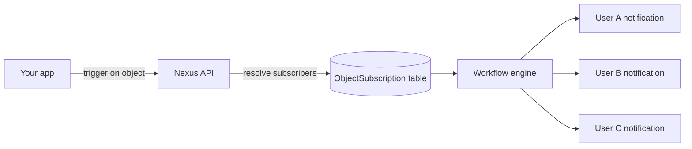

**Objects** are first-class entities in Nexus — think projects, documents, orders, or any resource your users subscribe to. When you trigger a workflow with an object as the recipient, Nexus automatically resolves all subscribers and runs the workflow for each of them.

## The problem objects solve

Without objects, every fan-out trigger requires your backend to:

1. Query your database for "who is watching this resource?"
2. Build a list of recipient IDs
3. Pass that full list on every trigger call

Objects move that relationship into Nexus, so a single trigger delivers to all watchers automatically.



## Concepts

| Term             | Description                                                            |
| :--------------- | :--------------------------------------------------------------------- |
| **Collection**   | A logical type grouping (e.g., `"projects"`, `"orders"`, `"channels"`) |
| **Object**       | A single entity within a collection, identified by `externalId`        |
| **Subscription** | A mapping from a subscriber to an object with optional properties      |

## Create or update an object

Objects are upserted — calling `set` on an existing `externalId` updates its fields.

**Node SDK:**

```ts
await nexus.objects.set({
  collection: 'projects',
  externalId: 'proj_alpha',
  name: 'Project Alpha',
  properties: { status: 'active', owner: 'team-eng' },
});
```

**Management API (server-side, `sk_*` key):**

```http
PUT /v1/management/objects/projects/proj_alpha
Authorization: Bearer sk_prd_…
Content-Type: application/json

{
  "name": "Project Alpha",
  "properties": { "status": "active", "owner": "team-eng" }
}
```

Object properties are available in templates as `{{ object.name }}`, `{{ object.properties.status }}`.

## Manage subscriptions

**Add subscribers to an object:**

```ts
await nexus.objects.addSubscriptions('projects', 'proj_alpha', {
  recipients: ['user_alice', 'user_bob'],
  // or: recipients: [{ externalId: 'user_alice' }]
});
```

**Remove subscribers from an object:**

```ts
await nexus.objects.removeSubscriptions('projects', 'proj_alpha', ['user_bob']);
```

<Callout type="info">
  Recipients must already exist as **subscribers** in the same environment before they can be added
  to an object. Use `nexus.subscribers.identify()` first if you haven't created them yet.
</Callout>

The `recipients` field accepts either plain `externalId` strings or objects with `{ externalId: string }` shape.

## Trigger with object fan-out

Pass an object recipient using `{ collection, id }` in your trigger call:

```ts
await nexus.workflows.trigger({
  workflowName: 'project.updated',
  recipients: [{ collection: 'projects', id: 'proj_alpha' }],
  data: { changeType: 'milestone_completed', updatedBy: 'sarah' },
});
```

The workflow worker resolves all active subscribers of `proj_alpha` and runs one workflow execution per subscriber. Subscriber context (`subscriber.email`, `subscriber.locale`, etc.) is available in templates as normal.

## Mix objects and subscribers

A single trigger call can include both objects and individual subscribers:

```ts
await nexus.workflows.trigger({
  workflowName: 'project.updated',
  recipients: [
    { collection: 'projects', id: 'proj_alpha' }, // fan-out to all watchers
    { externalId: 'admin_user' }, // explicit individual
  ],
  data: { changeType: 'status_change' },
});
```

## Per-object subscription properties

When adding subscribers, you can store subscription-level metadata:

```ts
await nexus.objects.addSubscriptions('projects', 'proj_alpha', {
  recipients: ['user_alice'],
  properties: { role: 'owner', notifyOnAll: true },
});
```

## Per-object preferences

Subscribers can mute a specific object while keeping notifications active for others. The preference is scoped under the object key in the subscriber's preference matrix — no code change needed on your side.

## API limits

| Limit                                      | Value                 |
| :----------------------------------------- | :-------------------- |
| Max objects per environment                | Configurable per plan |
| Max subscriptions per object               | Configurable per plan |
| Max recipients per `addSubscriptions` call | 100                   |

## Related

- [Object fan-out guide](/docs/platform/guides/object-fanout)
- [Objects API](/docs/api/objects)
- [Node SDK](/docs/sdk/backend/node)
- [Broadcasts](/docs/platform/features/broadcasts)
