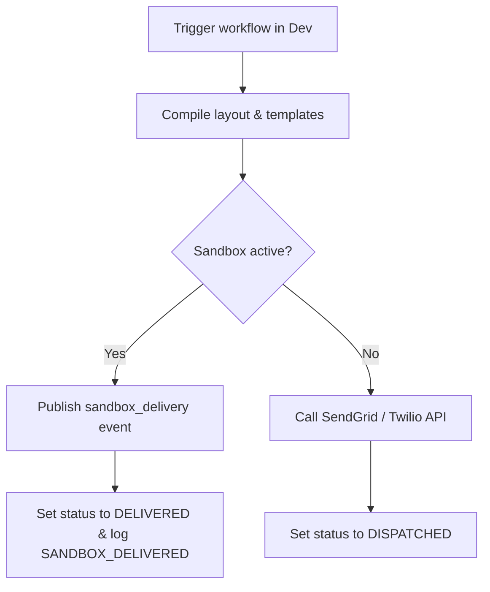

**Sandbox Mode** is automatically enabled for all external channels in the **Development** environment. Instead of making outbound API requests to providers like SendGrid or Twilio, Nexus intercepts the dispatch and routes it through a sandbox simulator.

---

## How sandbox simulator works

1. When a workflow reaches a channel step (e.g. email, SMS, push, webhook), the execution context is evaluated.
2. The compiler detects that the environment name is `development` (`ctx.sandboxMode = true`).
3. Outbound dispatch is routed to the **Sandbox Provider** (`sandbox`) instead of live carrier integrations.
4. The simulator publishes a real-time event of type `sandbox_delivery` to the Redis pub/sub channel.
5. The execution log updates the status directly to **`DELIVERED`** (instead of `DISPATCHED`) and appends the `SANDBOX_DELIVERED` lifecycle step.
6. The compiled payload body, subject line, and raw properties are saved in `responseMeta.outbound` with `sandbox: true`.



---

## Dashboard sandbox console

You can view and test sandbox deliveries in the dashboard:

1. Navigate to **Activities → Sandbox** in the dashboard.
2. The page establishes a WebSocket connection and listens for `sandbox_delivery` events.
3. You see live mocks of:
   - SMS bubbles containing the raw body.
   - HTML frames showing compiled emails.
   - Push banners.
   - Slack and MS Teams payloads.

This lets you test typography, Handlebars variable replacement, layout partials, and logic flows in real time without real provider costs.

---

## Chaos mode (Outage testing)

Simulate API provider outages directly in your development environment to test how your workflows handle outages:

1. Navigate to **Integrations** in the dashboard.
2. Select any integration card and toggle **Chaos Mode** to `on` (this sets `environment.chaosMode = true`).
3. When you trigger a workflow in development, the provider dispatcher intercepts the call and forces a mock `503 Service Unavailable` error, returning:
   ```json
   { "error": "Chaos mode simulated failure" }
   ```
4. This triggers the workflow's [failover](/docs/platform/features/failover) paths or circuit breakers immediately, allowing you to debug fallback branches in the audit log.

## Environment behaviors

| Channel               | Development (Sandbox)   | Staging / Production          |
| :-------------------- | :---------------------- | :---------------------------- |
| **In-App Inbox**      | Live WebSocket delivery | Live WebSocket delivery       |
| **Email**             | Sandbox (simulated)     | Real SMTP / API dispatch      |
| **SMS & WhatsApp**    | Sandbox (simulated)     | Real Twilio / Sinch dispatch  |
| **Mobile & Web Push** | Sandbox (simulated)     | Real FCM / APNs dispatch      |
| **Webhooks & Chat**   | Sandbox (simulated)     | Real Slack / Discord dispatch |

## Related

- [Environments](/docs/platform/getting-started/environments)
- [Provider failover](/docs/platform/features/failover)
- [Quickstart](/docs/platform/getting-started/quickstart)
