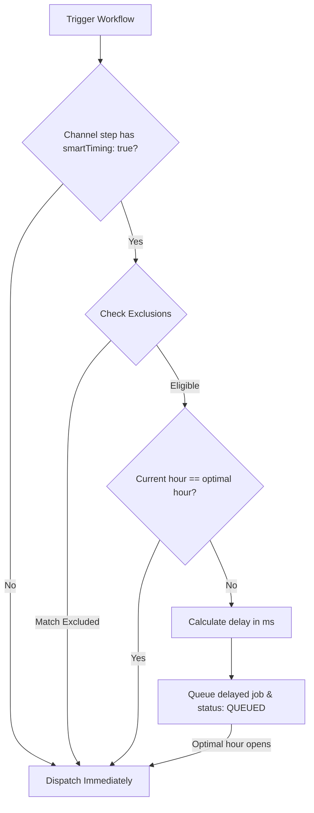

**Smart Send-Time** is a machine learning feature that learns when each subscriber is most likely to read or open messages. It automatically delays delivery until the subscriber's peak local hour, increasing read rates and minimizing notification fatigue.

---

## How it works

1. **Track Engagement**: Nexus monitors `READ` and `OPENED` events in execution logs for each subscriber (using a 60-day lookback window).
2. **Compute Score Matrix**: A background scoring service recalculates an hourly engagement matrix (24 hours × 7 days) in the subscriber's local timezone every **6 hours**.
3. **Save to Redis**: The calculated peak engagement hour is cached in Redis under `engagement:scores:<subscriberId>`.
4. **Evaluate at Send**: When a channel step runs with smart timing enabled:
   - If the current hour is already the optimal hour, execution continues immediately, logging `SMART_TIMING_PASS` with `reason: "already_optimal"`.
   - If it is not the optimal hour, Nexus calculates the milliseconds delay until the next occurrence of that hour, schedules a delayed BullMQ job `smartTiming:<logId>:<nodeId>`, updates log status to `QUEUED`, and logs `SMART_TIMING_HOLD`.



---

## Exclusions & fallbacks

### Fallback hour

If a subscriber has insufficient engagement history (less than **5 logged events**), the timing model falls back to a default value of **10:00 AM local time** (using `reason: "fallback"`).

### Execution exclusions

Smart timing is automatically disabled for:

- **Excluded channels**: In-App (`IN_APP`) and Webhook (`WEBHOOK`) steps are delivered immediately.
- **Workflow structures**: Any workflow containing a [Delivery Window](/docs/platform/features/delivery-windows) node anywhere in its graph is excluded from timing optimization.
- **Scheduled triggers**: Workflows initiated via scheduled cron templates.
- **Applied flag**: If smart timing was already applied earlier in the same workflow execution.

---

## Canvas setup

To enable smart timing:

1. Click on any channel node (Email, SMS, Push, WhatsApp, Chat) in the workflow canvas.
2. In the right sidebar, toggle **AI Send Time** to active.
3. Save the workflow.

## Workflow-as-code

In your typescript definitions, pass `smartTiming: true` in the channel configuration:

```ts
import { defineWorkflow } from '@nexus-signal/node';

defineWorkflow('marketing.newsletter')
  .addChannel('EMAIL', {
    smartTiming: true,
  })
  .toDefinition();
```

## Related

- [Delivery windows](/docs/platform/features/delivery-windows) — static quiet hours (delivery windows take precedence if both are defined in a workflow)
- [Cost reduction](/docs/platform/features/cost-reduction) — combine timing with presence suppression
- [Subscribers API](/docs/api/subscribers) — setting subscriber timezones
