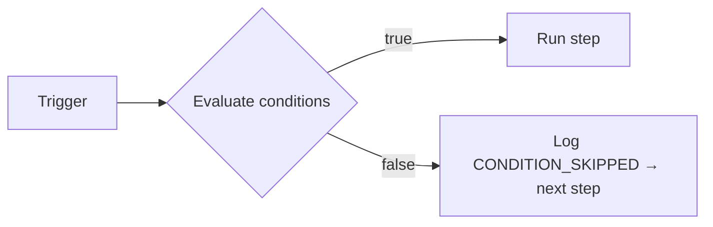

**Step conditions** let you attach filter rules to any node in the workflow canvas. If the conditions evaluate to `false`, the step is **skipped** and execution continues to the next node — no error is thrown, no retry occurs.

## How conditions work

When the workflow engine reaches a step that has conditions configured, it evaluates all rules against the live execution context **before** executing the step. Skipped steps are logged with `CONDITION_SKIPPED` in the execution lifecycle tree.



## Condition structure

```json
{
  "logic": "AND",
  "rules": [
    { "variable": "data.amount", "operator": "greater_than", "value": 500 },
    { "variable": "subscriber.locale", "operator": "equals", "value": "en" }
  ]
}
```

- `logic`: `"AND"` (all rules must pass) or `"OR"` (any single rule passing is enough)
- `rules`: Array of rule objects, each with `variable`, `operator`, and `value`

## Supported variable namespaces

Variables are resolved from the live execution context at the moment the step runs. This means data enriched by earlier steps (e.g., HTTP Fetch output) is available.

| Namespace      | Example variables                                                | Source                                                       |
| :------------- | :--------------------------------------------------------------- | :----------------------------------------------------------- |
| `data.*`       | `data.amount`, `data.plan`, `data.status`                        | Trigger payload + HTTP Fetch / AI Node output                |
| `subscriber.*` | `subscriber.email`, `subscriber.locale`, `subscriber.externalId` | Subscriber record                                            |
| `env.*`        | `env.name`                                                       | Current environment name (`development`, `production`, etc.) |

<Callout type="warn">
  Only `data.*`, `subscriber.*`, and `env.*` are supported. Variables like `tenant.*` or `object.*`
  are not resolved in step conditions.
</Callout>

## Supported operators

| Operator                 | Works on            | Description                                 |
| :----------------------- | :------------------ | :------------------------------------------ |
| `equals`                 | String, number      | Strict string equality after coercion       |
| `not_equals`             | String, number      | Negation of `equals`                        |
| `greater_than`           | Number              | `>` comparison                              |
| `greater_than_or_equals` | Number              | `>=` comparison                             |
| `less_than`              | Number              | `<` comparison                              |
| `less_than_or_equals`    | Number              | `<=` comparison                             |
| `contains`               | String              | Substring match                             |
| `not_contains`           | String              | Inverted substring match                    |
| `starts_with`            | String              | Prefix match                                |
| `ends_with`              | String              | Suffix match                                |
| `is_empty`               | String, array, null | `null`, `""`, or `[]`                       |
| `is_not_empty`           | String, array, null | Not empty                                   |
| `in_list`                | String              | Value is in a comma-separated or array list |
| `not_in_list`            | String              | Value is not in list                        |
| `regex_match`            | String              | Tests against a regular expression          |
| `is_true`                | Boolean             | `true`, `"true"`, or `1`                    |
| `is_false`               | Boolean             | `false`, `"false"`, `0`, or `null`          |

## Canvas usage

1. Click any node in the workflow canvas
2. Open the **Conditions** panel in the right sidebar
3. Add rules using the field picker, operator dropdown, and value input
4. Choose **AND** or **OR** logic

Rules take effect on the next workflow trigger — no redeploy required.

## Using conditions with dynamic data

After an **HTTP Fetch** or **AI Node** step, their output is available under `data.*` for downstream conditions. For example, if an HTTP Fetch step uses `responseKey: "invoice"`, you can condition an email step on `data.invoice.status`:

```json
{
  "logic": "AND",
  "rules": [{ "variable": "data.invoice.status", "operator": "equals", "value": "overdue" }]
}
```

## Workflow-as-code example

```ts
import { defineWorkflow } from '@nexus-signal/node';

defineWorkflow('invoice.reminder')
  .addChannel('EMAIL')
  .addChannel('SMS', {
    conditions: {
      logic: 'AND',
      rules: [
        { variable: 'data.amount', operator: 'greater_than', value: 500 },
        { variable: 'subscriber.locale', operator: 'equals', value: 'en' },
      ],
    },
  })
  .toDefinition();
```

The `conditions` option is available on every step builder method: `addChannel`, `addDelay`, `addDigest`, `addThrottle`, `addHttpFetch`, and `addAiNode`.

## Related

- [Workflows](/docs/platform/concepts/workflows)
- [HTTP Fetch node](/docs/platform/features/http-fetch-node)
- [AI workflow node](/docs/platform/features/ai-workflow-node)
- [Workflow-as-code](/docs/sdk/workflow/workflow-as-code)
