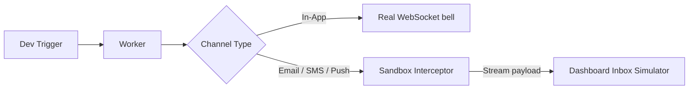
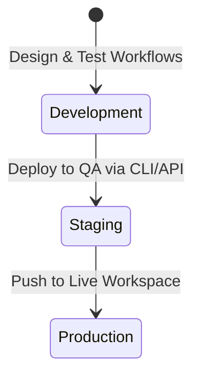

# Environments & Scopes

Every Nexus Signal workspace is divided into **three fully isolated environments**: **Development**, **Staging**, and **Production**.

Each environment operates as an independent logical database partition, meaning that workflows, templates, subscribers, preferences, topics, and tenant settings **do not cross boundaries**.

---

## Environment Matrix

| Feature                   | Development                                       | Staging                                            | Production                                |
| :------------------------ | :------------------------------------------------ | :------------------------------------------------- | :---------------------------------------- |
| **API Keys**              | `pk_dev_*` / `sk_dev_*`                           | `pk_stg_*` / `sk_stg_*`                            | `pk_prd_*` / `sk_prd_*`                   |
| **Outbound Dispatch**     | **Sandbox interception** (Simulated carrier APIs) | Real Carrier dispatch (Postmark, Twilio, SendGrid) | Real Carrier dispatch (Live users)        |
| **In-App Delivery**       | Live WebSockets to active client sessions         | Live WebSockets to active client sessions          | Live WebSockets to active client sessions |
| **Database Scoping**      | Isolated                                          | Isolated                                           | Isolated                                  |
| **Chaos Mode (Failover)** | Enabled (Allows simulating provider downtimes)    | Disabled                                           | Disabled                                  |

---

## Development & Sandbox Mode

The **Development** environment is engineered for local integration and automated tests.

To save carrier credits and prevent accidental messaging to real users during development, outbound nodes (Email, SMS, Push, WhatsApp, Chat platforms) route directly to a **virtual sandbox** instead of calling external APIs.

- **Inbox Simulator**: In the dashboard, you can view the fully compiled HTML, SMS text, or JSON payload as it would appear to the user.
- **Opt-out of Sandbox**: If you need to test real delivery in Development (e.g. testing an actual email layout in your client client), toggle **Integrations → Development Integrations → Bypass Sandbox** for that provider.

---

## Workspace Promotion Flow

To deploy changes from Development to Production, use our promotion pipeline instead of replicating layouts manually:

### Promoting Workflows as Code (Recommended)

By defining your step trees inside your repository, you promotion pipeline is handled automatically via git branches:

1. **Dev Branch**: Run `npx nexus-signal sync --env dev` inside your local workspace.
2. **Main Branch**: Trigger `npx nexus-signal sync --env prd` from your CI/CD pipeline upon merging.

For details, see the [Workflow-as-Code](/docs/sdk/workflow/workflow-as-code) documentation.

---

## Subscriber Separation

Subscribers are fully sandboxed. A subscriber created with `externalId: usr_99` using `sk_dev_*` **does not exist** in the `sk_prd_*` environment.

- Make sure your server-side onboarding trigger creates or registers the subscriber profile whenever switching environments.
- Test preferences and topics independently across stages.
