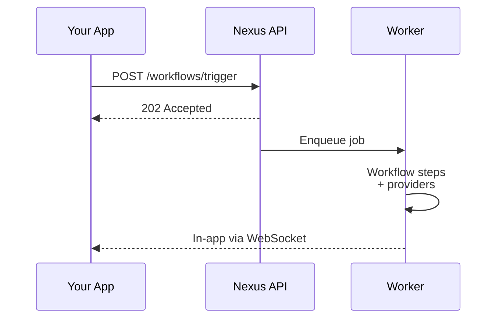

Welcome to Nexus Signal. This section walks you from zero to a working trigger in three steps: **workspace → providers → SDK trigger**.

<Cards>
  <Card
    title="Quickstart"
    href="/docs/platform/getting-started/quickstart"
    description="First trigger in under 5 minutes."
  />
  <Card
    title="Environments"
    href="/docs/platform/getting-started/environments"
    description="Dev, Staging, Production keys."
  />
  <Card
    title="Authentication"
    href="/docs/platform/getting-started/authentication"
    description="Secret keys, public keys, HMAC."
  />
</Cards>

## Prerequisites

- A Nexus Signal account ([sign up free](https://app.nexussignal.dev))
- Node.js 18+ for the server SDK
- At least one provider account (SendGrid, Resend, Twilio, etc.)

## How delivery works

Every delivery is logged with full lifecycle states for debugging and analytics.
