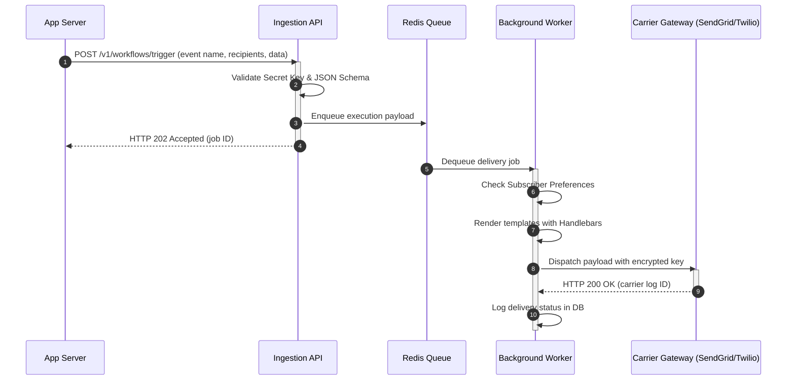

# Getting Started

Welcome to **Nexus Signal**. This section guides you from a fresh account to triggering your first multi-channel notification workflow.

To get started, you will walk through three core steps:

1. **Workspace Setup**: Creating your workspace and retrieving your environment keys.
2. **Provider Configuration**: Connecting your carrier keys (SendGrid, Twilio, Resend, etc.) in the dashboard.
3. **Trigger Event**: Emitting a POST payload from your backend application using our SDKs.

---

<Cards>
  <Card
    title="Quickstart Guide"
    href="/docs/platform/getting-started/quickstart"
    description="Trigger your first workflow and verify the delivery logs in under 5 minutes."
  />
  <Card
    title="Environments & Scopes"
    href="/docs/platform/getting-started/environments"
    description="Manage isolated workspaces for Development, Staging, and Production stages."
  />
  <Card
    title="Authentication & Security"
    href="/docs/platform/getting-started/authentication"
    description="Configure server-side secret keys, client public keys, and secure HMAC signatures."
  />
</Cards>

---

## Prerequisites

Before starting your integration, ensure you have:

- A **Nexus Signal account**: Sign up for free on the [Nexus Dashboard](https://app.nexussignal.dev).
- **Node.js 18+** (or compatible backend environments) to run the server-side SDKs.
- **Active provider keys**: Credentials for at least one delivery channel (e.g., email via SendGrid, SMS via Twilio, push via Firebase Cloud Messaging).

---

## The Integration Flow

Nexus operates asynchronously. Your application sends events to our API, which instantly enqueues them for background execution:

```mermaid
sequenceDiagram
    autonumber
    participant App as App Server
    participant API as Ingestion API
    participant Q as Redis Queue
    participant Worker as Background Worker
    participant Carrier as Carrier Gateway (SendGrid/Twilio)

    App->>API: POST /v1/workflows/trigger (event name, recipients, data)
    activate API
    API->>API: Validate Secret Key & JSON Schema
    API->>Q: Enqueue execution payload
    API-->>App: HTTP 202 Accepted (job ID)
    deactivate API

    Q->>Worker: Dequeue delivery job
    activate Worker
    Worker->>Worker: Check Subscriber Preferences
    Worker->>Worker: Render templates with Handlebars
    Worker->>Carrier: Dispatch payload with encrypted key
    activate Carrier
    Carrier-->>Worker: HTTP 200 OK (carrier log ID)
    deactivate Carrier
    Worker->>Worker: Log delivery status in DB
    deactivate Worker
```

Every stage of the lifecycle is observable in real-time from the dashboard's **Audit Logs** and **Debugger** windows.
