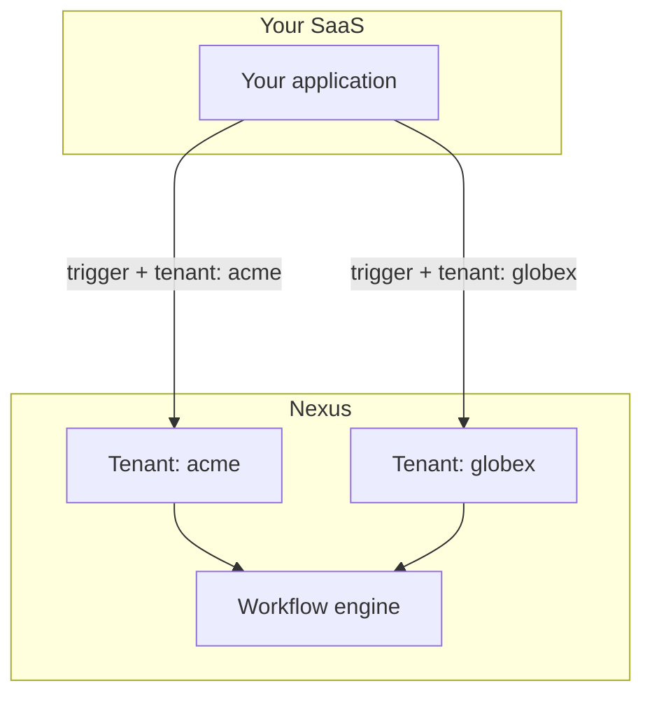

If your product serves multiple companies (tenants), Nexus **Tenants** let each customer get branded notifications without separate Nexus workspaces.

## Architecture



**Organization** = your Nexus workspace. **Tenant** = your customer's company inside that workspace.

## Step 1 — Create tenants

When a new customer signs up in your app:

```ts
await nexus.tenants.upsert({
  externalId: "tenant_acme",
  name: "Acme Corp",
  branding: {
    logoUrl: "https://cdn.acme.io/logo.png",
    primaryColor: "#2563eb",
    companyName: "Acme Corp",
    footerHtml: "<p>© Acme Corp · support@acme.io</p>",
  },
});
```

Supported branding fields: `logo`, `logoUrl`, `primaryColor`, `iconUrl`, `companyName`, `footerHtml`, `headerHtml`.

## Step 2 — Apply branding in email layouts

Create an [email layout](/docs/platform/features/email-layouts) that references branding:

```html

<div style="color: {{ branding.primaryColor }}">{{{ content }}}</div>
<footer>{{{ branding.footerHtml }}}</footer>
```

When a trigger includes `tenant`, the compiler injects that tenant's branding automatically.

## Step 3 — Trigger with tenant context

```ts
await nexus.workflows.trigger({
  workflowName: "invoice.sent",
  tenant: "tenant_acme",
  recipients: [{ externalId: user.id, email: user.email }],
  data: { invoiceId: "INV-001", amount: "$500" },
});
```

## Step 4 — Per-tenant preferences (optional)

Set `preferenceDefaults` on the tenant to control opt-in defaults for new subscribers under that tenant.

## Step 5 — Filter in-app feed by tenant

SDK notifications support tenant scoping via query parameter:

```http
GET /v1/sdk/notifications?subscriberExternalId=user_42&tenantId=tenant_acme
```

Use this when your app shows a tenant-scoped notification center.

## Checklist

<Steps>
  <Step>
    Create tenant on customer signup (sync `externalId` with your DB).
  </Step>
  <Step>
    Store branding assets (logo URLs must be HTTPS and publicly accessible).
  </Step>
  <Step>Pass `tenant` on every trigger for that customer's users.</Step>
  <Step>Test in Development with two tenants before Production.</Step>
</Steps>

## Related

- [Per-tenant branding](/docs/platform/features/tenants)
- [Email layouts](/docs/platform/features/email-layouts)
- [Tenants API](/docs/api/tenants)
