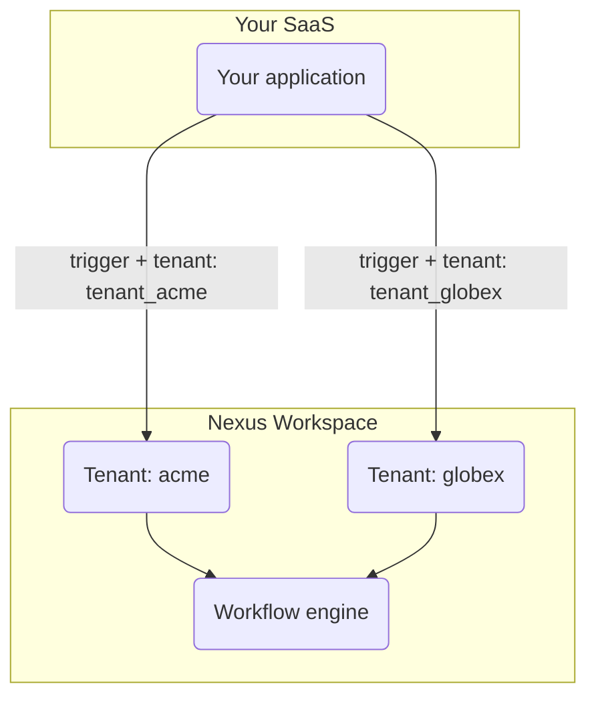

If your product serves multiple companies, Nexus **Tenants** let each customer receive branded notifications without separate workspaces per customer.

---

## How it works



**Organization** = your Nexus workspace (one per product).
**Tenant** = one of your B2B customers inside that workspace.

The `tenant` field on the trigger payload tells Nexus which customer's branding context to apply when compiling the message.

---

## Step 1 — Register tenants

Call the Node SDK `upsert` whenever a new company signs up in your app:

```ts
import { NexusClient } from '@nexus-signal/node';

const nexus = new NexusClient({ secretKey: process.env.NEXUS_SECRET_KEY });

await nexus.tenants.upsert({
  externalId: 'tenant_acme',
  name: 'Acme Corp',
  branding: {
    logo: 'https://cdn.acme.io/logo.png',
    primaryColor: '#2563eb',
    footerHtml: '<p>© Acme Corp · <a href="mailto:support@acme.io">support@acme.io</a></p>',
  },
  properties: {
    planTier: 'enterprise',
  },
});
```

**`branding` fields** — any string key-value pairs you want accessible in templates. Common keys:

| Key            | Example value                  |
| -------------- | ------------------------------ |
| `logo`         | `https://cdn.acme.io/logo.png` |
| `primaryColor` | `#2563eb`                      |
| `companyName`  | `Acme Corp`                    |
| `footerHtml`   | `<p>© Acme Corp</p>`           |

> **Note:** The `branding` object is a free-form `Record<string, string>` — you can define any keys and reference them inside templates as `{{ branding.yourKey }}`.

---

## Step 2 — Use branding in email layouts

Create an [email layout](/docs/platform/features/email-layouts) that references the tenant's branding keys:

```html
<header>
  
</header>

<main style="color: {{ branding.primaryColor }}">{{{ content }}}</main>

<footer>{{{ branding.footerHtml }}}</footer>
```

When a trigger includes a `tenant` value, the template compiler automatically injects that tenant's branding object into the Handlebars context.

---

## Step 3 — Trigger with tenant context

Pass the tenant's `externalId` in the `tenant` field of every trigger for that company's users:

```ts
await nexus.workflows.trigger({
  workflowName: 'invoice.sent',
  tenant: 'tenant_acme',
  recipients: [{ externalId: user.id }],
  data: {
    invoiceId: 'INV-001',
    amount: '$500',
  },
});
```

> The `tenant` field matches the `externalId` you used in the `upsert` call — not the internal UUID.

---

## Step 4 — Scope the in-app notification feed

When your app shows a tenant-scoped notification center, filter the SDK feed by the tenant's database UUID:

```http
GET /v1/sdk/notifications?subscriberExternalId=user_42&tenantId=<tenant-uuid>
x-nexus-public-key: pk_prd_your_public_key
```

<Callout type="info">
  `tenantId` in the SDK query is the internal **UUID** of the tenant (from the list response), not
  the `externalId` string. Use the [Tenants API](/docs/api/tenants) or Management API to retrieve
  it.
</Callout>

---

## Step 5 — Test with two tenants before Production

1. Create two test tenants (`tenant_acme`, `tenant_globex`) with different branding values in **Development**.
2. Trigger the same workflow twice — once per tenant — to the same subscriber.
3. Confirm that each email shows the correct logo and footer in the Sandbox preview.
4. Promote to **Production** only after branding renders correctly.

---

## Checklist

<Steps>
  <Step>
    Register each tenant on customer signup — sync `externalId` with your database's company ID.
  </Step>
  <Step>
    Upload branding assets to a publicly accessible HTTPS CDN. Nexus does not host images.
  </Step>
  <Step>
    Add the `tenant` field on every trigger fired for that company's users.
  </Step>
  <Step>
    Test with two tenants in Development before going live in Production.
  </Step>
</Steps>

---

## Related

- [Per-tenant branding feature guide](/docs/platform/features/tenants)
- [Email layouts](/docs/platform/features/email-layouts)
- [Tenants API reference](/docs/api/tenants)
