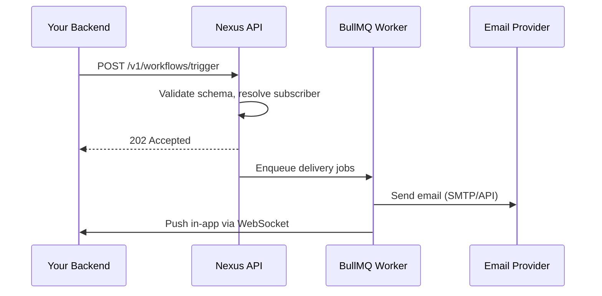

This guide walks you through building a **`user.signup`** welcome workflow that sends an email and an in-app notification the moment a user registers.

---

## Prerequisites

- A Nexus Signal workspace with at least one active environment
- Node SDK installed (`@nexus-signal/node`) and initialized with a secret key
- At least one email provider connected in **Integrations**

---

## Create the workflow [step]

In the dashboard, navigate to **Workflows** → **New Workflow**.

- **Name:** `user.signup`
- **Channels:** Add a **Email** node and an **In-App** node

Your canvas should look like:

```
Trigger → Email → In-App
```

> **Tip:** Enable **Suppress when online** on the Email node if you want to skip email delivery when the user is currently active in your app.

---

## Write the templates [step]

Click each channel node to open the template editor.

**Email template (HTML):**

```html
<h1>Welcome, {{ data.name }}!</h1>
<p>Thanks for joining. Your account ID is <strong>{{ subscriber.externalId }}</strong>.</p>
<p><a href="{{ data.dashboardUrl }}">Go to your dashboard →</a></p>
```

**In-App template:**

```json
{
  "title": "Welcome, {{ data.name }}!",
  "body": "Your account is ready. Click to explore.",
  "redirect": "{{ data.dashboardUrl }}"
}
```

When done, promote the templates to **Production Active** status.

---

## Create a test subscriber [step]

In the dashboard: **Subscribers** → **Add Subscriber**

Fill in:

- `externalId`: `test_user_01`
- `email`: `you@example.com`

> Subscribers must be created **before** triggering. The trigger endpoint identifies recipients by `externalId` — it does not register new users inline.

---

## Trigger from your backend [step]

Install and initialize the Node SDK:

```ts
import { NexusClient } from '@nexus-signal/node';

const nexus = new NexusClient({ secretKey: process.env.NEXUS_SECRET_KEY });
```

Fire the trigger after a user registers:

```ts
await nexus.workflows.trigger({
  workflowName: 'user.signup',
  recipients: [{ externalId: 'test_user_01' }],
  data: {
    name: 'Test User',
    dashboardUrl: 'https://app.example.com/dashboard',
  },
});
```

> **Note:** The `recipients` array accepts `externalId` or `subscriberId` to identify the target. Do **not** pass raw contact details like `email` or `phoneNumber` here — those belong on the subscriber profile, not the trigger payload.

In **Development** environment, emails are captured in the **Sandbox** tab — no real emails are sent.

---

## Add the in-app bell to your frontend [step]

Install the React SDK:

```bash
npm install @nexus-signal/react
```

Wrap your app and add the bell component:

```tsx
import { NexusProvider, NotificationCenterBell } from '@nexus-signal/react';

export function App() {
  return (
    <NexusProvider
      publicKey={process.env.NEXT_PUBLIC_NEXUS_PUBLIC_KEY!}
      subscriberId="test_user_01"
      hmacSignature={userSession.nexusHmac}
    >
      <NotificationCenterBell />
      {/* rest of your app */}
    </NexusProvider>
  );
}
```

> **Security:** `hmacSignature` must be generated server-side using your **Secret Key** + the subscriber's `externalId`. Never compute it in the browser. See [Authentication](/docs/platform/getting-started/authentication) for the HMAC formula.

Trigger again — the bell badge increments in real time via WebSocket.

---

## What happens internally



---

## Next steps

- Add [Smart Send-Time](/docs/platform/features/smart-send-time) to email for optimal open rates
- Assign this workflow to a [Topic](/docs/platform/features/topics) for user preference control
- Set a [Delivery Window](/docs/platform/features/delivery-windows) to avoid sending at night
- Add a [step condition](/docs/platform/features/step-conditions) to skip email when the user is on mobile
