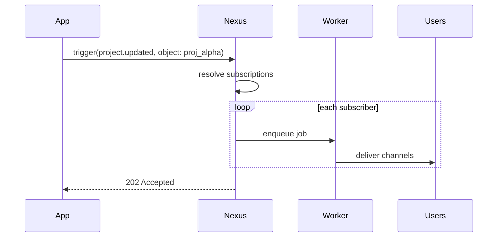

This guide walks through **objects & subscriptions** end-to-end: create an object, subscribe users, trigger fan-out, and use object properties in templates.

## Scenario

Your app has projects. When a project updates, every team member watching it should get notified — without your backend querying a `watchers` table.

## Step 1 — Create the object

Dashboard: **Objects** → create collection `projects`, ID `proj_alpha`.

Or via Node SDK:

```ts
await nexus.objects.set({
  collection: 'projects',
  externalId: 'proj_alpha',
  name: 'Project Alpha',
  properties: { status: 'active', repo: 'acme/alpha' },
});
```

## Step 2 — Subscribe users

When a user clicks "Watch project" in your app:

```ts
await nexus.objects.addSubscriptions('projects', 'proj_alpha', {
  recipients: [user.externalId],
});
```

To unsubscribe:

```ts
await nexus.objects.removeSubscriptions('projects', 'proj_alpha', [user.externalId]);
```

## Step 3 — Create a workflow

Create `project.updated` in the dashboard with In-App + Email channels. Use object properties in templates:

```html
<p>Project <strong>{{ object.name }}</strong> was updated.</p>
<p>Status: {{ object.properties.status }}</p>
```

## Step 4 — Trigger with object recipient

```ts
await nexus.workflows.trigger({
  workflowName: 'project.updated',
  recipients: [{ collection: 'projects', id: 'proj_alpha' }],
  data: { changeType: 'milestone_completed', milestone: 'v1.0' },
});
```

Nexus resolves all subscribers and runs the workflow for each user individually.



## Step 5 — Verify delivery

Check **Audit Logs** in the dashboard. Each subscriber gets a separate execution log row.

## Tips

- Use meaningful `collection` names (`issues`, `orders`, `channels`) — they appear in API paths
- Object properties can drive [step conditions](/docs/platform/features/step-conditions): `object.properties.priority`
- Combine with [topics](/docs/platform/features/topics) for user preference control

## Related

- [Objects & Subscriptions](/docs/platform/features/objects-subscriptions)
- [Objects API](/docs/api/objects)
- [Workflows API](/docs/api/workflows)
