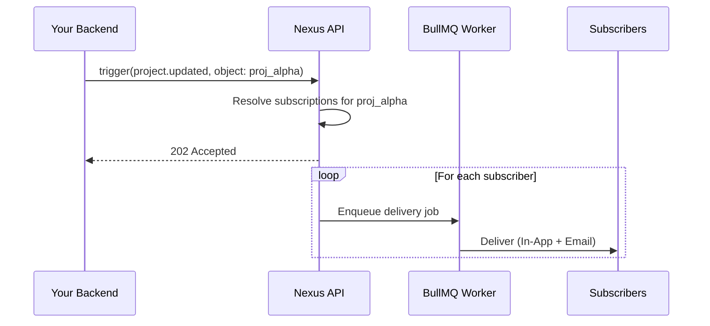

This guide walks through the complete **Objects & Subscriptions** flow: register an entity, subscribe users to it, and fan-out notifications to all watchers in one trigger call.

---

## The problem this solves

Without objects, your backend needs to:

1. Query a `watchers` table to get the subscriber list
2. Loop and trigger a workflow for each user individually

With Objects, Nexus maintains the watcher list for you. You trigger once with the object reference and Nexus resolves + delivers to all subscribers automatically.

---

## Scenario

Your app has projects. When a project milestone completes, every team member watching it should be notified instantly — without your backend ever querying the watchers table.

---

## Step 1 — Register the object

When a new project is created in your app, upsert it in Nexus:

```ts
import { NexusClient } from '@nexus-signal/node';

const nexus = new NexusClient({ secretKey: process.env.NEXUS_SECRET_KEY });

await nexus.objects.set({
  collection: 'projects',
  externalId: 'proj_alpha',
  name: 'Project Alpha',
  properties: {
    status: 'active',
    repo: 'acme/alpha',
    priority: 'high',
  },
});
```

- `collection`: Lowercase alphanumeric with dashes/underscores (e.g. `projects`, `issues`, `orders`). This becomes part of the API path.
- `externalId`: Your app's internal ID for the entity (max 128 characters).
- `properties`: Any custom key-value metadata — accessible in templates as `{{ object.properties.key }}`.

---

## Step 2 — Subscribe users

When a user clicks **Watch** in your UI:

```ts
await nexus.objects.addSubscriptions('projects', 'proj_alpha', {
  recipients: [user.externalId],
  properties: { role: 'watcher' }, // optional per-subscription metadata
});
```

- `recipients`: Array of subscriber `externalId` strings. The subscribers must already exist in the environment.
- `properties`: Optional key-value metadata stored on the subscription (e.g. `role`, `notificationLevel`).

When a user clicks **Unwatch**:

```ts
await nexus.objects.removeSubscriptions('projects', 'proj_alpha', [user.externalId]);
```

---

## Step 3 — Create the workflow

In the dashboard, create a workflow named `project.updated` with **In-App** and **Email** channel nodes.

Use object context variables in the templates:

**In-App template:**

```json
{
  "title": "{{ object.name }} was updated",
  "body": "Status changed to {{ object.properties.status }}",
  "redirect": "/projects/{{ object.externalId }}"
}
```

**Email template (HTML):**

```html
<h2>Update: {{ object.name }}</h2>
<p>The project status is now <strong>{{ object.properties.status }}</strong>.</p>
<p>Milestone reached: {{ data.milestone }}</p>
```

Available object context variables:

- `{{ object.name }}` — the object's display name
- `{{ object.externalId }}` — the object's external ID
- `{{ object.collection }}` — the collection name
- `{{ object.properties.key }}` — any custom property

---

## Step 4 — Trigger with object recipient

When the milestone completes, trigger with the object reference instead of a subscriber list:

```ts
await nexus.workflows.trigger({
  workflowName: 'project.updated',
  recipients: [{ collection: 'projects', id: 'proj_alpha' }],
  data: {
    changeType: 'milestone_completed',
    milestone: 'v1.0 Launch',
  },
});
```

Nexus resolves all active subscribers watching `projects/proj_alpha` and creates individual delivery jobs for each one.



---

## Step 5 — Verify delivery

In the dashboard, open **Audit Logs**. Each watcher gets a separate log row showing their individual delivery status and channel output.

---

## Tips

- **Batch subscribe on import**: Use `addSubscriptions` with an array of up to 100 recipients at once when migrating existing data.
- **Object properties drive step conditions**: Use `{{ object.properties.priority }}` in [step conditions](/docs/platform/features/step-conditions) to send email only for high-priority objects.
- **Combine with topics**: Add the workflow to a [topic](/docs/platform/features/topics) so users can opt out of project notifications at the preference level.
- **Clean up on delete**: Call `nexus.objects.delete('projects', 'proj_alpha')` when the project is deleted to remove all subscriptions automatically.

---

## Limits

| Limit                       | Value  |
| --------------------------- | ------ |
| Max objects per environment | 5,000  |
| Max watchers per object     | 10,000 |
| Max add/remove batch size   | 100    |
| Max custom property keys    | 50     |

---

## Related

- [Objects & Subscriptions feature overview](/docs/platform/features/objects-subscriptions)
- [Objects API reference](/docs/api/objects)
- [Step conditions](/docs/platform/features/step-conditions) — property-driven branching
