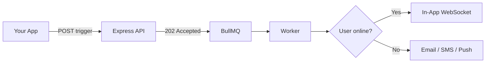

# Nexus Signal Platform

**Nexus Signal** is developer-first notification infrastructure. One API and a visual workflow canvas route messages across **10 channels** while you keep **your own provider keys** — no per-message markup, no lock-in.

Everything about running Nexus as your notification control plane — from first workflow to production.

<Cards>
  <Card title="Quickstart" href="/docs/platform/getting-started/quickstart" description="Send your first notification in under 5 minutes." />
  <Card title="Getting Started" href="/docs/platform/getting-started" description="Workspace, environments, and authentication." />
  <Card title="Concepts" href="/docs/platform/concepts" description="Architecture, BYOP, workflows, pipeline." />
  <Card title="Features" href="/docs/platform/features" description="Smart timing, presence, AI, cost tools." />
  <Card title="Integrations" href="/docs/platform/integrations" description="SendGrid, Twilio, Slack, webhooks." />
  <Card title="Guides" href="/docs/platform/guides/first-workflow" description="First workflow and production checklist." />
</Cards>

## What makes Nexus different

| Capability | Benefit |
|------------|---------|
| **Presence suppression** | Skip redundant push/SMS when users are online — lower provider spend |
| **AI smart send-time** | Deliver at each subscriber's peak engagement hour |
| **BYOP** | Your SendGrid, Twilio, Resend keys — zero message markup |
| **Cost analytics** | Spend per provider, channel, and workflow with budget alerts |
| **Visual workflows** | Delay, digest, throttle, failover, A/B split, delivery windows |

## Ten channels, one trigger

Email · SMS · Web Push · Mobile Push · In-App · WhatsApp · Slack · Discord · Teams · Webhook

```ts
await nexus.workflows.trigger({
  workflowName: 'order.shipped',
  recipients: [{ externalId: 'user_42', email: 'alex@acme.io' }],
  data: { trackingNumber: '1Z999AA10123456784' },
});
```

Returns **202 Accepted** immediately — delivery runs asynchronously via Redis + BullMQ.

## Core flow



## When to read what

| You want to… | Read |
|--------------|------|
| Send first notification | [Quickstart](/docs/platform/getting-started/quickstart) |
| Understand async pipeline | [Delivery pipeline](/docs/platform/concepts/delivery-pipeline) |
| Reduce provider spend | [Cost reduction](/docs/platform/features/cost-reduction) |
| Improve open rates | [Smart send-time](/docs/platform/features/smart-send-time) |
| Go live safely | [Production checklist](/docs/platform/guides/production-checklist) |

<Callout type="info">
New here? Start with [Quickstart](/docs/platform/getting-started/quickstart), then read [Architecture](/docs/platform/concepts/architecture).
</Callout>

## Stack

Node.js · PostgreSQL · Redis · React — sub-10ms ingestion API, observable delivery pipeline.
