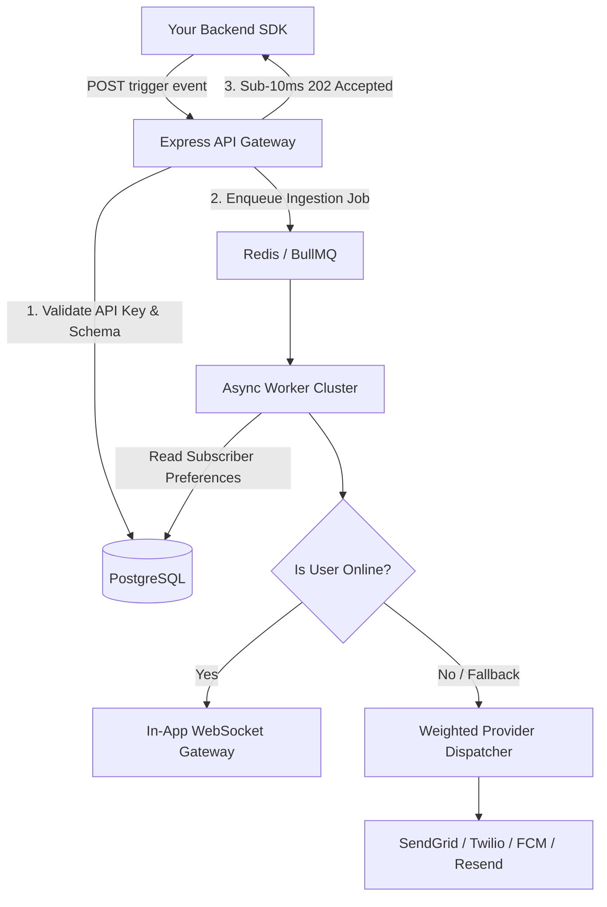

# Nexus Signal Platform

**Nexus Signal** is a developer-first notification infrastructure. One unified API and a visual workflow canvas route messages across **10 channels** while you keep **your own provider keys** — avoiding per-message markups and vendor lock-in.

Think of Nexus as your centralized notification control plane, orchestrating delivery from initial trigger events to production callbacks.

<Cards>
  <Card
    title="Quickstart"
    href="/docs/platform/getting-started/quickstart"
    description="Send your first notification in under 5 minutes."
  />
  <Card
    title="Getting Started"
    href="/docs/platform/getting-started"
    description="Workspace, environments, and authentication."
  />
  <Card
    title="Concepts"
    href="/docs/platform/concepts"
    description="Architecture, BYOP, workflows, pipeline."
  />
  <Card
    title="Features"
    href="/docs/platform/features"
    description="Objects, broadcasts, AI nodes, guides, and more."
  />
  <Card
    title="Integrations"
    href="/docs/platform/integrations"
    description="SendGrid, Twilio, Slack, webhooks."
  />
  <Card
    title="Guides"
    href="/docs/platform/guides"
    description="Workflows, fan-out, broadcasts, multi-tenant."
  />
</Cards>

## Core Differences

| Capability               | Developer & Business Benefit                                                                                                         |
| ------------------------ | ------------------------------------------------------------------------------------------------------------------------------------ |
| **Presence Suppression** | Skips redundant push/SMS if the user has an active in-app WebSocket session — significantly reducing carrier spend.                  |
| **AI Smart Send-Time**   | Automatically analyzes user activity to deliver notification digests or messages during their peak engagement hour.                  |
| **BYOP Architecture**    | Connects SendGrid, Twilio, Resend, and SNS credentials directly. You pay carriers at cost with absolute control.                     |
| **Cost Analytics**       | Detailed tracking of spend per provider, channel, and individual workflow event with automated budget threshold alerts.              |
| **Visual Workflows**     | Compose step trees with delays, throttles, A/B testing splits, conditional filters, HTTP Fetch nodes, and LLM content generators.    |
| **Object Fan-out**       | Notify all subscribers of a project, document, team, or issue with a single trigger payload without manual DB lookup queries.        |
| **B2B Multi-Tenancy**    | White-label email templates, in-app branding, and delivery preferences per customer organization (tenant).                           |
| **CLI & MCP Tools**      | Manage workflows as code under version control and integrate with AI coding assistants (like Cursor, Claude Code) via an MCP server. |

---

## Ten Channels, One Trigger API

Rather than managing custom integrations for Email, SMS, Web Push, Mobile Push, In-App Bells, WhatsApp, Slack, Discord, Microsoft Teams, and Webhooks individually, you emit a single event to Nexus:

```ts
import { NexusClient } from '@nexus-signal/node';

const nexus = new NexusClient({ secretKey: process.env.NEXUS_SECRET_KEY! });

await nexus.workflows.trigger({
  workflowName: 'order.shipped',
  recipients: [{ externalId: 'user_42', email: 'alex@acme.io' }],
  tenant: 'tenant_acme_corp', // Scopes styling & preferences to this customer tenant
  data: {
    customerName: 'Alex',
    orderId: 'ord_990142',
    trackingNumber: '1Z999AA10123456784',
  },
});
```

The trigger endpoint returns an **HTTP 202 Accepted** payload in under 10ms. The platform enqueues the event to a resilient Redis-backed queue where workers process your step rules, compile localized templates, and route messages to your carriers.

---

## High-Level Execution flow


```mermaid
flowchart TD
    App[Your Backend SDK] -->|POST trigger event| API[Express API Gateway]
    API -->|1. Validate API Key & Schema| DB[(PostgreSQL)]
    API -->|2. Enqueue Ingestion Job| Q[Redis / BullMQ]
    API -->|3. Sub-10ms 202 Accepted| App
    Q --> Worker[Async Worker Cluster]
    Worker -->|Read Subscriber Preferences| DB
    Worker --> Presence{Is User Online?}
    Presence -->|Yes| InApp[In-App WebSocket Gateway]
    Presence -->|No / Fallback| Carriers[Weighted Provider Dispatcher]
    Carriers --> CarrierAPIs[SendGrid / Twilio / FCM / Resend]
```

---

## Document Navigation Guide

| You want to…                                      | Suggested Page                                                                    |
| ------------------------------------------------- | --------------------------------------------------------------------------------- |
| Integrate your first workflow                     | [Quickstart](/docs/platform/getting-started/quickstart)                           |
| Secure your webhook or WebSocket connection       | [Authentication & HMAC Signatures](/docs/platform/getting-started/authentication) |
| Understand the queue retry and execution pipeline | [Delivery Pipeline Concepts](/docs/platform/concepts/delivery-pipeline)           |
| Broadcast announcements to a subset of users      | [Broadcasts Feature Guide](/docs/platform/features/broadcasts)                    |
| Configure per-customer white-labeled branding     | [B2B Multi-Tenancy Walkthrough](/docs/platform/guides/b2b-multi-tenant)           |
| Monitor provider margins and channel metrics      | [Cost Reduction Strategies](/docs/platform/features/cost-reduction)               |
| Deploy changes safely through environments        | [Environments & API Key Scopes](/docs/platform/getting-started/environments)      |

<Callout type="info">
  Are you integrating for the first time? Start with the
  [Quickstart](/docs/platform/getting-started/quickstart) to send your first event, then read
  [Architecture](/docs/platform/concepts/architecture) to configure your development server.
</Callout>

## Technology Stack

The Nexus Signal host is built using standard, high-performance web components:

- **API Gateway**: Node.js & Express
- **Databases**: PostgreSQL (via Prisma ORM) & Redis (caching and pub/sub)
- **Queue Manager**: BullMQ (backpressure routing, delayed retries)
- **Realtime**: Socket.IO (WebSocket connection engine for in-app bells)
- **UI Components**: React & Tailwind CSS
