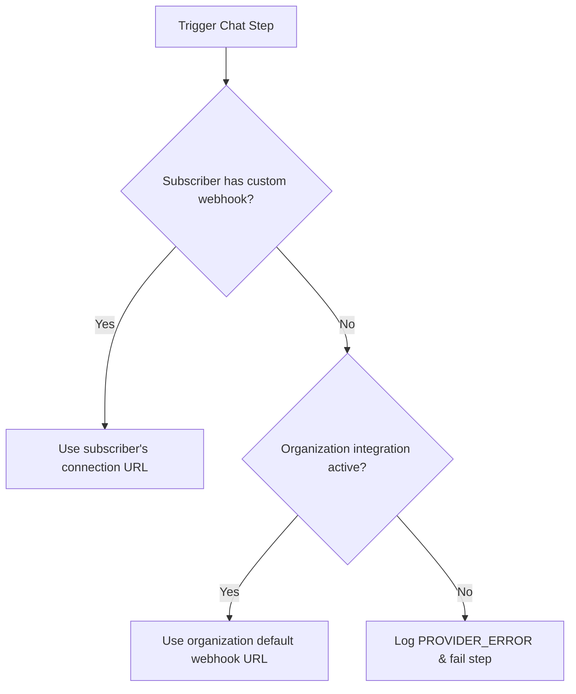

Nexus includes native channel nodes for **Slack**, **Discord**, and **Microsoft Teams**. You can configure organization-level channels (e.g., sending system alerts to your own company's Slack) or route notifications to unique, subscriber-specific channel webhooks.

---

## Webhook credentials hierarchy

When dispatching chat notifications, Nexus determines which webhook URL to use in this priority order:

1. **Subscriber Webhook**: Checks the subscriber's profile for custom connection URLs (e.g. `slackWebhookUrl` in the subscriber's `channelConnections`).
2. **Organization Webhook**: Falls back to the default credentials stored in your environment's integration settings for that provider.



---

## Per-subscriber webhook routing

To route notifications to subscriber-specific channels (e.g., personal Slack DM channels, team workspace channels), pass unique webhook URLs in the trigger request:

```ts
await nexus.workflows.trigger({
  workflowName: 'billing.invoice',
  recipients: [
    {
      externalId: 'user_42',
      slackWebhookUrl: 'https://hooks.slack.com/services/{workspace_id}/{channel_id}/{token}',
      discordWebhookUrl: 'https://discord.com/api/webhooks/{channel_id}/{token}',
      teamsWebhookUrl:
        'https://your-org.webhook.office.com/webhookb2/{guid}@{tenant_id}/IncomingWebhook/{id}/{token}',
    },
  ],
  data: { amount: 150 },
});
```

### Automatic persistence

- When webhook URLs are passed in a trigger payload, Nexus automatically extracts them and saves them to the subscriber's `channelConnections` object in the database.
- Future triggers for the same subscriber will reuse these cached connection URLs — you only need to pass them once (usually when the user links their chat tool in your application's settings UI).

---

## Expected payload formats

Nexus automatically adapts the text copy of your templates to match the layout specifications of each chat platform:

| Channel             | Key        | Format | Adapter behavior                                                                      |
| :------------------ | :--------- | :----- | :------------------------------------------------------------------------------------ |
| **Slack**           | `slack`    | JSON   | Dispatches payload as `{ "text": "..." }`. Supports standard Slack markdown (mrkdwn). |
| **Discord**         | `discord`  | JSON   | Dispatches payload as `{ "content": "..." }`.                                         |
| **Microsoft Teams** | `ms_teams` | JSON   | Compiles an Adaptive Card JSON block containing the message title and body.           |

## Workflow setup

1. Create a workflow and add a **Slack**, **Discord**, or **Teams** channel node to the canvas.
2. In the node settings, select the provider key to fallback to.
3. Save and trigger the workflow.

## Related

- [Node SDK client](/docs/sdk/backend/node) — recipient schema documentation
- [Webhooks integrations](/docs/platform/integrations/webhooks) — custom payload dispatches
- [Translation files](/docs/platform/features/translations) — localizing chat text
