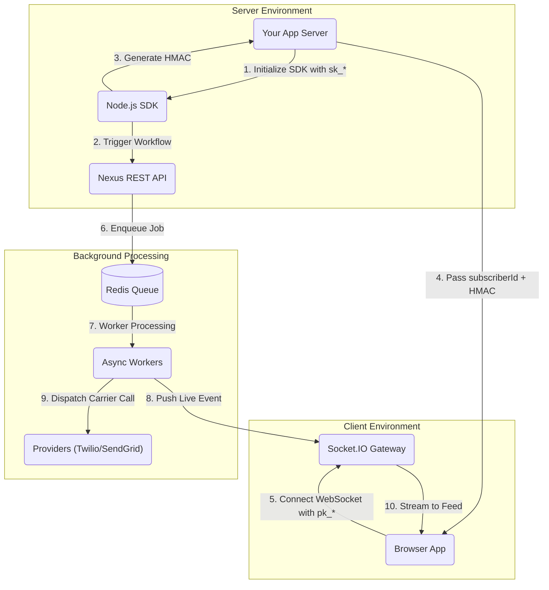

# Nexus Signal SDKs

Official libraries, client components, command-line interfaces, and AI toolkits to integrate Nexus Signal into your stack.

---

## Client & Server Libraries

Access our primary client-side and server-side libraries to manage triggers, subscribers, and interface states:

<Cards>
  <Card
    title="Node.js SDK"
    href="/docs/sdk/backend/node"
    description="Backend workflow triggers, multi-tenant scopes, schedules, and cryptographic HMAC signatures."
  />
  <Card
    title="React SDK"
    href="/docs/sdk/frontend/react"
    description="Drop-in notification bell, full-feed inbox, user preferences matrix, and real-time guides."
  />
  <Card
    title="Headless JS SDK"
    href="/docs/sdk/frontend/js"
    description="Framework-agnostic client for Vue, Svelte, or vanilla HTML5 with no bundled styling dependencies."
  />
  <Card
    title="Angular SDK"
    href="/docs/sdk/frontend/angular"
    description="Standalone components and native Signals for reactive notification centers (Angular 17+)."
  />
</Cards>

---

## Developer Tooling

Manage workflow states, CI/CD integrations, and local template bundles:

<Cards>
  <Card
    title="Workflow-as-code"
    href="/docs/sdk/workflow/workflow-as-code"
    description="Define notification steps in TypeScript and push them programmatically to the dashboard."
  />
  <Card
    title="Nexus CLI"
    href="/docs/sdk/devtools/cli"
    description="Pull or push resources, manage subscribers, and sync templates from your terminal or runner."
  />
  <Card
    title="MCP Server"
    href="/docs/sdk/devtools/mcp-server"
    description="Connect AI coding assistants like Cursor and Claude to your workspace tools using natural language."
  />
  <Card
    title="API Reference"
    href="/docs/api"
    description="Direct REST API endpoints for customized HTTP integrations in any programming language."
  />
</Cards>

---

## Integrated Architecture Flow

The following diagram tracks the transaction boundary between server-side dispatches, user-agent sockets, and external provider relays:



---

## Package Support Matrix

Ensure your target runtimes meet the minimal environment prerequisites:

| Package Namespace              | Core Runtime      | Peer Dependencies           | Primary Responsibility                                   |
| :----------------------------- | :---------------- | :-------------------------- | :------------------------------------------------------- |
| **`@nexus-signal/node`**       | Node.js >= 18.0.0 | None (Native Fetch)         | Backend triggers, schedules, object sync, workflow sync. |
| **`@nexus-signal/react`**      | React >= 18.0.0   | `socket.io-client >= 4.8.0` | Pre-styled bells, full-page feeds, preferences.          |
| **`@nexus-signal/js`**         | ES6 / HTML5       | `socket.io-client >= 4.8.0` | Framework-agnostic store handlers, WebSocket emitters.   |
| **`@nexus-signal/angular`**    | Angular >= 17.0.0 | `socket.io-client >= 4.8.0` | Reactive Signals, standalone component wrappers.         |
| **`@nexus-signal/cli`**        | Node.js >= 18.0.0 | None                        | Local schema sync, CI/CD promotion pipelines.            |
| **`@nexus-signal/mcp-server`** | Node.js >= 18.0.0 | None                        | Natural language tool calls for AI coding assistants.    |

---

## Installation Quick-Start

Configure libraries depending on the entry points in your application:

<Tabs items={['Server-side', 'React Client', 'Dev Tooling']}>
  <Tab value="Server-side">
    To run triggers and sync workflows from your backend routes:
    ```bash
    npm install @nexus-signal/node
    ```
  </Tab>
  <Tab value="React Client">
    To mount in-app notification centers and user settings inside a React tree:
    ```bash
    npm install @nexus-signal/react socket.io-client
    ```
  </Tab>
  <Tab value="Dev Tooling">
    To access local sync mechanisms or start an MCP instance:
    ```bash
    # Install CLI globally
    npm install -g @nexus-signal/cli

    # Run MCP server on-the-fly
    npx -y @nexus-signal/mcp-server@latest
    ```
  </Tab>
</Tabs>

<Callout type="warn">
**Key Exposure Rule**: Never embed secret keys starting with `sk_` in client-side code, Single Page Apps (SPAs), or bundle scripts. Public routes must always utilize public keys (`pk_`) verified against an HMAC signature generated strictly on your server.
</Callout>
