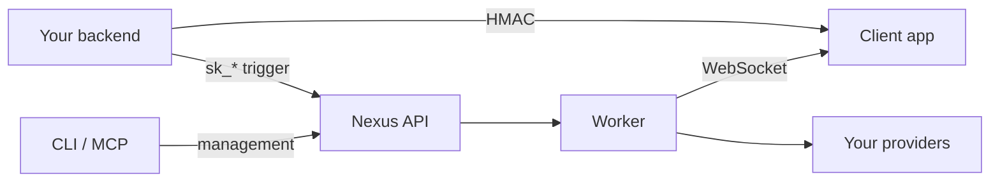

# Nexus Signal SDKs

Official packages for server triggers, client inbox UI, terminal automation, and AI assistant integration.

## Client & server SDKs

<Cards>
  <Card title="Node.js SDK" href="/docs/sdk/backend/node" description="Triggers, objects, tenants, broadcasts, schedules." />
  <Card title="React SDK" href="/docs/sdk/frontend/react" description="Bell, inbox, guides, preference matrix." />
  <Card title="Headless JS SDK" href="/docs/sdk/frontend/js" description="Vue, Svelte, vanilla JS — no UI bundled." />
  <Card title="Angular SDK" href="/docs/sdk/frontend/angular" description="Standalone components + signals." />
</Cards>

## Developer tooling

<Cards>
  <Card title="Workflow-as-code" href="/docs/sdk/workflow/workflow-as-code" description="defineWorkflow() + sync to platform." />
  <Card title="Nexus CLI" href="/docs/sdk/devtools/cli" description="Pull/push resources, CI/CD automation." />
  <Card title="MCP server" href="/docs/sdk/devtools/mcp-server" description="AI assistant tools for Cursor, Claude Code." />
  <Card title="API Reference" href="/docs/api" description="Raw REST if you prefer HTTP." />
</Cards>

## Integration flow



1. Backend triggers with **secret key** (`sk_*`) and generates **HMAC** for the logged-in user
2. Frontend connects via `NexusProvider` (React/Angular) or `NexusClient` (JS) with **public key + HMAC**
3. In-app notifications stream over WebSocket; guides fetch via REST
4. CLI/MCP manage workflows and resources from terminal or AI IDE

## Quick trigger

```ts
import { NexusClient } from '@nexus-signal/node';

const nexus = new NexusClient({
  secretKey: process.env.NEXUS_SECRET_KEY!,
  baseUrl: 'https://api.nexussignal.dev',
});

await nexus.workflows.trigger({
  workflowName: 'order.shipped',
  recipients: [{ externalId: 'user_42', email: 'alex@acme.io' }],
  tenant: 'tenant_acme',
  data: { trackingNumber: '1Z999AA10123456784' },
});
```

## Package matrix

| Package | Runtime | Use for |
|---------|---------|---------|
| `@nexus-signal/node` | Node.js 18+ | Server triggers, objects, sync |
| `@nexus-signal/react` | Browser + React 18/19 | Drop-in UI components |
| `@nexus-signal/js` | Browser (any framework) | Headless inbox + guides |
| `@nexus-signal/angular` | Browser + Angular 17+ | Standalone components |
| `@nexus-signal/cli` | Node.js 18+ | Terminal + CI/CD |
| `@nexus-signal/mcp-server` | Node.js 18+ | AI coding assistants |

## Install

<Tabs items={['Server', 'React', 'Tooling']}>
  <Tab value="Server">

```bash
npm install @nexus-signal/node
```

  </Tab>
  <Tab value="React">

```bash
npm install @nexus-signal/react socket.io-client
```

  </Tab>
  <Tab value="Tooling">

```bash
npm install -g @nexus-signal/cli
npx @nexus-signal/mcp-server@latest
```

  </Tab>
</Tabs>

<Callout type="warn">
Never expose `sk_*` secret keys in browser code. Use `pk_*` public keys for client SDK routes only.
</Callout>
