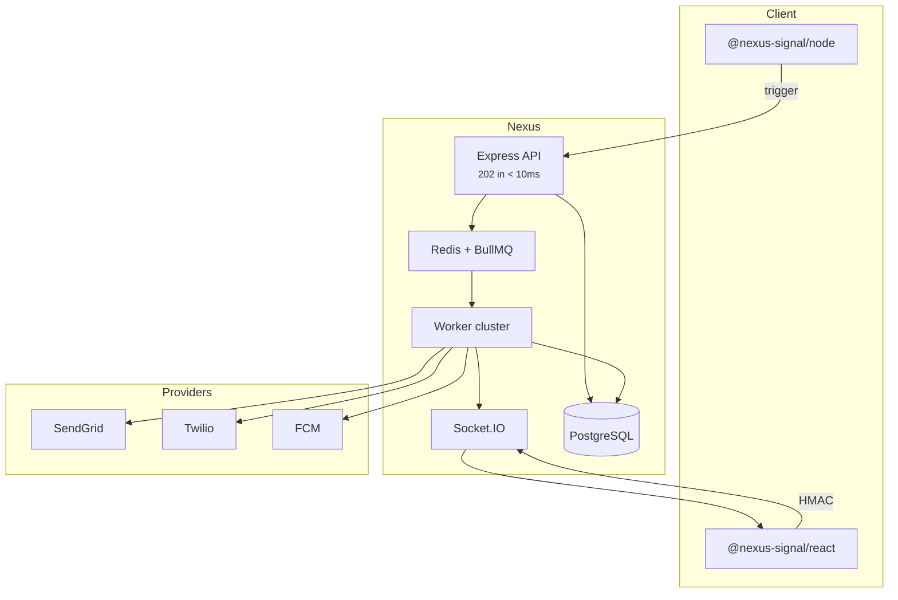

## Diagrama del sistema

## Componentes

| Capa          | Tecnología          | Rol                                            |
| ------------- | ------------------- | ---------------------------------------------- |
| Ingestion API | Node.js + Express   | Auth, validar, encolar, devolver 202           |
| Core database | PostgreSQL + Prisma | Orgs, workflows, suscriptores, logs            |
| Queue         | Redis + BullMQ      | Jobs async, delays, digest, circuit breaker    |
| Workers       | Node.js             | Ejecutar pasos, compilar plantillas, despachar |
| Realtime      | Socket.IO           | In-app, sync de lectura, simulador sandbox     |
| Dashboard     | React SPA           | Canvas, plantillas, analítica                  |

## Ingestión no bloqueante

La API **nunca** llama a carriers ni compila plantillas pesadas durante la petición HTTP. Escribe un log `INGESTED`, encola un job y responde de inmediato.

## Multi-tenancy

Los recursos tienen alcance **organización** → **entorno** (Development, Staging, Production). Cada entorno tiene claves, suscriptores y workflows aislados.

<Callout type="idea">
  Development usa **modo sandbox** — los canales externos se simulan para que
  pruebes sin gasto en proveedores. Consulta
  [Sandbox](/docs/platform/features/sandbox).
</Callout>

## Relacionado

- [Pipeline de entrega](/docs/platform/concepts/delivery-pipeline)
- [BYOP](/docs/platform/concepts/byop)
