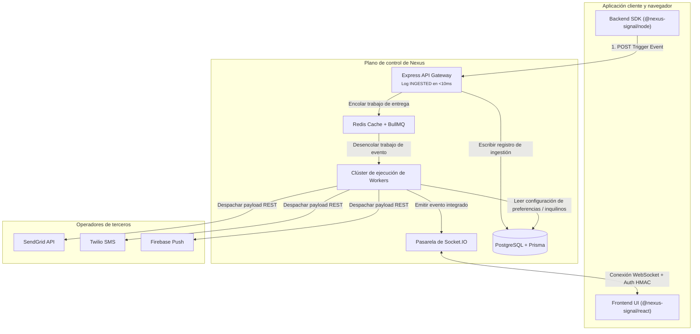

# Arquitectura del sistema

Nexus Signal está diseñado como un sistema de orquestación de notificaciones desacoplado y de alto rendimiento. La plataforma consta de cinco capas principales para separar la ingestión de los disparadores (triggers) de la compilación y entrega real de las notificaciones:

---

## Diagrama del sistema

```mermaid
flowchart TB
  subgraph Client [Aplicación cliente y navegador]
    SDK["Backend SDK (@nexus-signal/node)"]
    UI["Frontend UI (@nexus-signal/react)"]
  end

  subgraph Nexus [Plano de control de Nexus]
    API["Express API Gateway<br/><small>Log INGESTED en &lt;10ms</small>"]
    Q["Redis Cache + BullMQ"]
    W["Clúster de ejecución de Workers"]
    WS["Pasarela de Socket.IO"]
    DB[(PostgreSQL + Prisma)]
  end

  subgraph Providers [Operadores de terceros]
    SG[SendGrid API]
    TW[Twilio SMS]
    FCM[Firebase Push]
  end

  SDK -->|1. POST Trigger Event| API
  API -->|Escribir registro de ingestión| DB
  API -->|Encolar trabajo de entrega| Q
  Q -->|Desencolar trabajo de evento| W
  W -->|Leer configuración de preferencias / inquilinos| DB
  W -->|Despachar payload REST| SG & TW & FCM
  W -->|Emitir evento integrado| WS
  WS <-->|Conexión WebSocket + Auth HMAC| UI
```

---

## Componentes arquitectónicos

| Componente             | Tecnología            | Responsabilidad                                                                                                                                                       | Rendimiento                                         |
| :--------------------- | :-------------------- | :-------------------------------------------------------------------------------------------------------------------------------------------------------------------- | :-------------------------------------------------- |
| **API de Ingestión**   | Node.js + Express     | Valida las credenciales de autorización y los esquemas de triggers; encola los trabajos; devuelve confirmación inmediata.                                             | Tiempos de respuesta sub-10ms.                      |
| **BD Relacional**      | PostgreSQL + Prisma   | Persiste la configuración del espacio de trabajo, las credenciales del entorno, las estructuras de las plantillas, los suscriptores y los registros de transacciones. | Ruta de lectura/escritura indexada.                 |
| **Gestor de Mensajes** | Redis + BullMQ        | Gestiona los canales de colas en tiempo real, los flujos de trabajo retrasados, los resúmenes por lotes y la programación de contrapresión (backpressure).            | Rendimiento con almacenamiento en caché de memoria. |
| **Workers**            | Node.js Worker Pool   | Ejecuta los nodos del flujo de trabajo de forma secuencial; maneja los ajustes de la zona horaria local, divisiones A/B y despachos.                                  | Escalamiento de forma horizontal.                   |
| **Centro WebSockets**  | Pasarela de Socket.IO | Mantiene canales de WebSocket persistentes hacia los navegadores activos para entregar alertas instantáneas dentro de la aplicación (in-app).                         | Envío (push) guiado por eventos.                    |
| **Panel Web**          | React + Next.js SPA   | Diseñador visual de plantillas mediante arrastrar y soltar, registros de ejecución y simuladores de sandbox.                                                          | Renderizado estático en el cliente.                 |

---

## Ingestión de eventos no bloqueante

Para mantener tiempos de respuesta inferiores a 10 ms en los triggers de tu backend, la API de ingestión **nunca** realiza ninguna de las siguientes tareas de forma síncrona:

- Compilar motores de plantillas.
- Evaluar reglas lógicas de bifurcación de pasos condicionales.
- Realizar búsquedas de DNS o solicitudes HTTP REST a las pasarelas de operadores externos (por ejemplo, SendGrid, Twilio).

En su lugar, la pasarela escribe una sola fila en PostgreSQL con el estado `INGESTED`, publica los metadatos del payload en BullMQ y responde de inmediato a tu SDK de servidor con un código de estado **HTTP 202 Accepted** que contiene el ID de la transacción.

---

## Resiliencia de colas y contrapresión

Al apoyarse en BullMQ, Nexus protege tus sistemas de backend de las latencias de red y de las caídas de los operadores:

- **Reintentos de trabajos**: Si Twilio o SendGrid devuelve un HTTP 500 o experimenta límites de velocidad, el worker vuelve a encolar el trabajo en Redis utilizando una estrategia de **retroceso exponencial** (exponential backoff).
- **Disyuntor (Circuit Breaking)**: Si un operador devuelve fallas continuas a lo largo de una ventana de límite, el despachador activa un **Nodo de Failover** para enrutar las notificaciones a través de un canal alternativo (por ejemplo, fallback de SMS a Push).
- **Limitación de velocidad (Rate Throttling)**: Los workers enrutan los mensajes respetando estrictamente los límites de velocidad configurados por integración de proveedor.

---

## Pasarela de WebSocket persistente

Las notificaciones integradas en la aplicación (como campanas de notificación o mensajes flotantes personalizados) se enrutan a través de nuestra pasarela WebSocket Socket.IO dedicada.

- **Seguridad**: Los handshakes requieren una firma HMAC válida generada por tu servidor, lo que evita la suplantación de identidad del ID del suscriptor.
- **Estado de entrega**: Si un usuario está conectado activamente a través de WebSocket, el worker puede omitir el despacho de canales externos como SMS o Push (supresión por presencia), disminuyendo los costos de mensajería.
