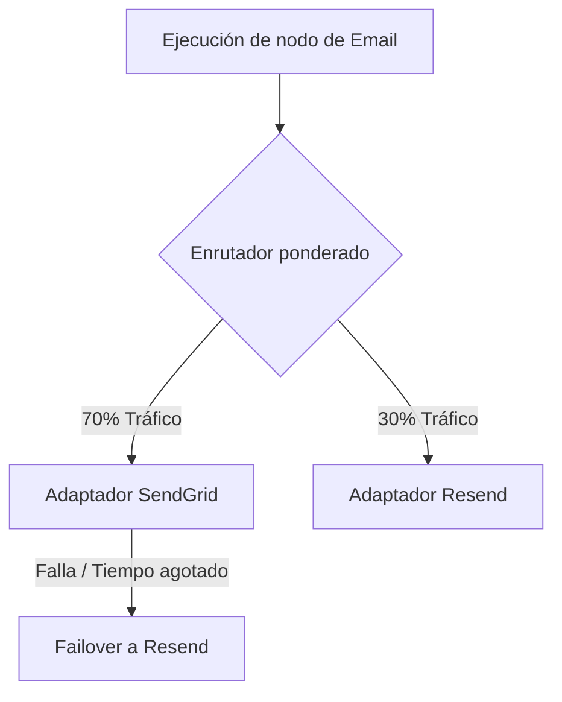

# Bring Your Own Provider (BYOP)

**BYOP (Bring Your Own Provider)** es la base de Nexus Signal. A diferencia de las plataformas de notificaciones tradicionales que actúan como intermediarios y cobran un recargo sobre cada correo electrónico o SMS, Nexus actúa puramente como la capa de software de orquestación.

Ingresas **tus propias claves API** de los proveedores y pagas las tarifas de facturación del operador directamente a precio de costo.

---

## Análisis de costos: Tradicional vs. BYOP

Los volúmenes de notificaciones suelen escalar rápidamente, convirtiendo los recargos por mensaje en un gasto operativo importante:

| Métrica                       | Plataforma de notificaciones tradicional                      | Nexus Signal (BYOP)                                                  |
| :---------------------------- | :------------------------------------------------------------ | :------------------------------------------------------------------- |
| **Modelo de facturación**     | Suscripción + recargo por volumen de mensajes.                | Suscripción de tarifa plana a la plataforma únicamente.              |
| **Recargo por mensaje**       | Frecuentemente incrementado del 50% al 200%.                  | **0% de recargo**. Pagas al operador directamente a precio de costo. |
| **Redundancia del operador**  | Bloqueado al operador seleccionado por la plataforma.         | Enrutamiento ponderado y failover instantáneo entre tus proveedores. |
| **Control de entregabilidad** | Grupos compartidos de reputación de IP (mala entregabilidad). | Selección de IP dedicada y configuración directa del remitente.      |

---

## Cifrado seguro de bóveda

Debido a que proporcionas tus propias credenciales, proteger tus claves API es nuestra máxima prioridad de seguridad.

- **Cifrado AES-256**: Las credenciales de los proveedores se cifran a nivel de base de datos dentro de la bóveda `providerKeys` de tu espacio de trabajo.
- **Alcance del descifrado**: Las claves se descifran en memoria estrictamente al momento del despacho del operador dentro de procesos de workers aislados.
- **Cero exposición en registros**: El registro de payloads sanitiza automáticamente los detalles de autenticación y los tokens de API para evitar que las claves se filtren en los registros de seguimiento de la entrega.

---

## Enrutamiento y redundancia

Con BYOP, no dependes de un solo operador. Puedes configurar múltiples cuentas de proveedores para un solo canal (por ejemplo, correo electrónico) y distribuir el tráfico de forma dinámica:

- **Enrutamiento ponderado**: Distribuye el `70%` del tráfico de correo electrónico a SendGrid y el `30%` a Resend para mantener las direcciones IP templadas (warm) entre múltiples proveedores.
- **Failover instantáneo**: Si una llamada a la API de SendGrid agota el tiempo de espera o devuelve una excepción de límite de velocidad, el worker despacha de inmediato el mensaje a través de Resend.

---

## Las claves de IA también son BYOP

Nexus Signal admite **Nodos de IA** en los flujos de trabajo visuales (por ejemplo, para la verificación de traducciones o disparadores de redacción dinámica). Estos nodos utilizan **tus propias claves de LLM** (OpenAI, Anthropic o Cohere). Nexus nunca ejecuta tareas de LLM a través de cuentas proxy compartidas. Mantienes un control total sobre las políticas de privacidad de datos y los límites de uso de tokens.
