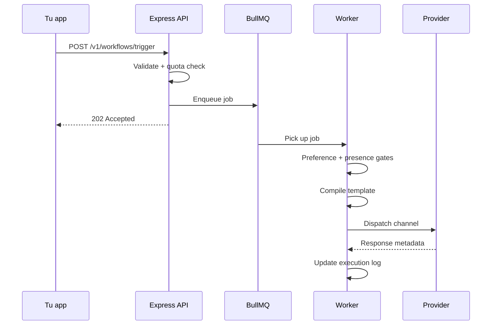

Cuando llamas a `workflows.trigger`, este pipeline se ejecuta de forma asíncrona.

## Resumen de pasos

| Paso | Qué ocurre |
|------|------------|
| **Ingestion** | Validar clave, resolver suscriptores, crear log, encolar |
| **Worker pickup** | Cargar workflow, plantilla, contexto de organización |
| **Gates** | Preferencias, supresión por presencia, smart timing, ventana de entrega |
| **Compile** | Handlebars + resolución de locale + URLs de click tracking |
| **Dispatch** | Router ponderado de proveedores → adaptador de carrier |
| **Telemetry** | WebSocket (in-app), click tracking, callbacks de carrier |

## Estados del ciclo de vida

`INGESTED` → `QUEUED` → `PROCESSING` → `DISPATCHED` → `DELIVERED` → `READ` / `OPENED` / `FAILED`

Especiales: `SKIPPED_BY_PREFERENCE`, `QUEUED_IN_DIGEST`, `FAILED_PROVIDER_DOWN`

<Callout type="warn">
Los triggers programados y las retenciones de smart timing reingresan a la cola con un delay — el estado puede mostrar `QUEUED` durante la espera.
</Callout>

Consulta la línea de tiempo completa en el drill-down de **Audit Logs**.
