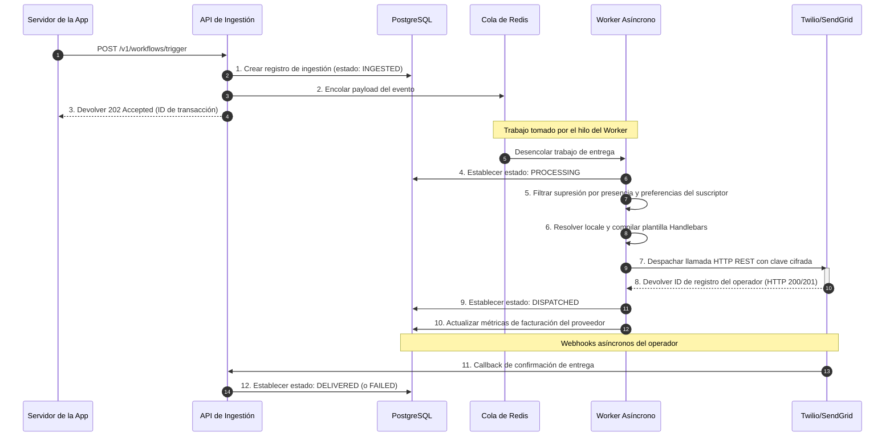

# Pipeline de entrega

Cuando el servidor de tu aplicación dispara un evento a través de `nexus.workflows.trigger()`, el evento entra en un pipeline de ejecución observable y de alto rendimiento. Las entregas se ejecutan de manera completamente asíncrona dentro de nuestros clústeres de workers en segundo plano.

---

## Secuencia detallada de telemetría

El siguiente diagrama sigue la ruta de la transacción desde la ingestión a través de las plantillas, verificaciones de preferencias, adaptadores de operadores e informes de entrega del proveedor:

```mermaid
sequenceDiagram
    autonumber
    participant App as Servidor de la App
    participant API as API de Ingestión
    participant DB as PostgreSQL
    participant Q as Cola de Redis
    participant W as Worker Asíncrono
    participant Carrier as Twilio/SendGrid

    App->>API: POST /v1/workflows/trigger
    API->>DB: 1. Crear registro de ingestión (estado: INGESTED)
    API->>Q: 2. Encolar payload del evento
    API-->>App: 3. Devolver 202 Accepted (ID de transacción)

    Note over Q, W: Trabajo tomado por el hilo del Worker
    Q->>W: Desencolar trabajo de entrega
    W->>DB: 4. Establecer estado: PROCESSING
    W->>W: 5. Filtrar supresión por presencia y preferencias del suscriptor
    W->>W: 6. Resolver locale y compilar plantilla Handlebars
    W->>Carrier: 7. Despachar llamada HTTP REST con clave cifrada
    activate Carrier
    Carrier-->>W: 8. Devolver ID de registro del operador (HTTP 200/201)
    deactivate Carrier

    W->>DB: 9. Establecer estado: DISPATCHED
    W->>DB: 10. Actualizar métricas de facturación del proveedor

    Note over Carrier, DB: Webhooks asíncronos del operador
    Carrier->>API: 11. Callback de confirmación de entrega
    API->>DB: 12. Establecer estado: DELIVERED (o FAILED)
```

---

## Fases del pipeline de ejecución

### 1. Fase de ingestión

- **Autenticación**: Comprueba el alcance de la Clave Secreta Bearer (`sk_`).
- **Validación**: Confirma que el `workflowName` exista y valida los esquemas de la matriz de destinatarios (`recipients`).
- **Creación del trabajo**: Genera un ID único persistente para cada destinatario de destino, registra la fila inicial `INGESTED` en la base de datos, inserta el contexto de ejecución en BullMQ y libera el hilo de la API.

### 2. Puertas de preferencias y presencia

Antes de compilar los recursos del mensaje, los workers evalúan si la notificación debe continuar:

- **Verificación de baja (Opt-out)**: Lee el catálogo de preferencias del destinatario. Si se ha dado de baja del tema (topic) o del canal, el nodo se omite con el estado `SKIPPED_BY_PREFERENCE`.
- **Intercepción de presencia activa**: Comprueba si el destinatario tiene una sesión de WebSocket activa en el gateway integrado de la aplicación. Si `suppressWhenOnline` está activo en el nodo de canal, se omiten los despachos externos.
- **Restricciones de hora local**: Si hay un nodo de `Delivery Window` (Ventana de entrega) presente, el worker calcula la compensación de la zona horaria local del suscriptor. Si la hora actual cae fuera de la ventana, el trabajo se retrasa en Redis.

### 3. Renderizado de plantillas

- **Búsqueda de locale**: Resuelve el locale preferido del suscriptor (`en`, `es`, `ja`, etc.).
- **Compilación de Handlebars**: Compila líneas de asunto, encabezados y plantillas HTML, combinando las variables del `data` del trigger.
- **Inyección de enlaces de seguimiento**: Reemplaza las URLs en las plantillas con enlaces de seguimiento de redirección personalizados para medir las métricas de clics.

### 4. Despacho del operador

- **Enrutamiento ponderado**: El despachador resuelve los adaptadores de proveedores activos y selecciona el operador en función de los pesos de integración.
- **Handshake del adaptador**: Descifra la clave de integración, compila el esquema de la API específico del proveedor y ejecuta la llamada REST.

---

## Definiciones detalladas de estados del ciclo de vida

Cada trabajo de entrega transiciona a través de un conjunto de estados de ciclo de vida observables:

| Estado                  | Significado y alcance                                                                                             |
| :---------------------- | :---------------------------------------------------------------------------------------------------------------- |
| `INGESTED`              | La API ha aceptado el payload del evento desencadenante (trigger).                                                |
| `QUEUED`                | El trabajo se encuentra actualmente en Redis esperando a los hilos de los workers.                                |
| `PROCESSING`            | Un worker está ejecutando el renderizado de la plantilla y las puertas de enlace.                                 |
| `DISPATCHED`            | El mensaje fue aceptado por la API del operador (SendGrid, Twilio, etc.).                                         |
| `DELIVERED`             | El webhook del operador confirmó que el usuario recibió el correo electrónico/SMS/push.                           |
| `OPENED` / `READ`       | El usuario abrió el correo (se disparó el píxel de seguimiento) o marcó el mensaje integrado (in-app) como leído. |
| `FAILED`                | Ocurrió un error durante la ejecución o el operador rechazó la entrega.                                           |
| `SKIPPED_BY_PREFERENCE` | La entrega se omitió porque el suscriptor se dio de baja del tema (topic).                                        |
| `QUEUED_IN_DIGEST`      | El evento está suspendido esperando el intervalo de agrupación del nodo digest.                                   |
| `FAILED_PROVIDER_DOWN`  | La pasarela del operador no estaba disponible; encolado para failover automático.                                 |

---

## Reintentos y recuperación de errores

Si un despacho del operador falla debido a caídas de red del operador o excepciones HTTP 5xx temporales, los workers ejecutan las siguientes rutinas de recuperación:

1. **Cola de reintentos**: El worker vuelve a encolar el trabajo en Redis utilizando una estrategia de **retroceso exponencial** (exponential backoff).
2. **Máximo de reintentos**: El trabajo se reintenta hasta 5 veces (configurado en Integraciones).
3. **Cola de mensajes no entregados (Dead-Letter Queue - DLQ)**: Si se agotan todos los reintentos, el estado se establece en `FAILED`, el stack trace se guarda en el registro de auditoría y se activan alertas para los desarrolladores.
