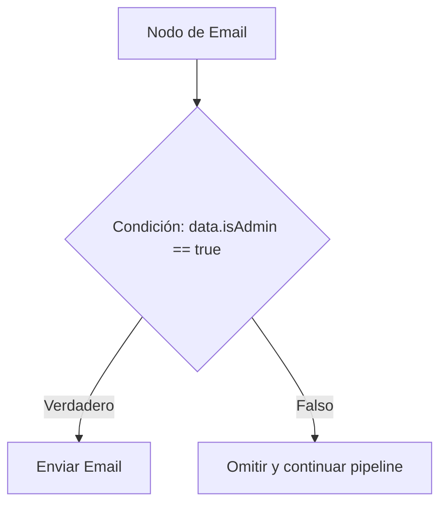

# Workflows visuales y plantillas

Un **workflow (flujo de trabajo)** es el plan estructural de automatización (`user.welcome`, `billing.payment_failed`) que gestiona los triggers de tus eventos. Los workflows se componen visualmente en el lienzo del panel de control como un **árbol de pasos** de nodos funcionales.

---

## Eventos desencadenantes (Triggers)

Cada flujo de trabajo comienza con un único **Nodo Trigger** que define el espacio de nombres (namespace) del evento. Cuando tu servidor de aplicaciones dispara un evento utilizando el SDK, el parámetro `workflowName` debe coincidir con este identificador visual:

```ts
await nexus.workflows.trigger({
  workflowName: 'user.welcome', // Coincide con el espacio de nombres del nodo trigger
  recipients: [{ externalId: 'user_12' }],
  data: { name: 'Alex' },
});
```

---

## Catálogo detallado de nodos

El constructor visual de lienzo admite diez clases de nodos para controlar el tiempo del mensaje, la lógica de ejecución y las opciones de proveedores:

| Clase de nodo       | Icono           | Acción y función                                                                                                                                                                                       |
| :------------------ | :-------------- | :----------------------------------------------------------------------------------------------------------------------------------------------------------------------------------------------------- |
| **Channel Node**    | `MessageSquare` | Despacha notificaciones a través de correo electrónico, SMS, Web Push, Mobile Push, campana In-App, Slack, Discord, Microsoft Teams, WhatsApp o Webhooks.                                              |
| **Delay Node**      | `Clock`         | Pausa la ejecución durante una duración relativa (por ejemplo, `24 horas` o `3 días`) antes de ejecutar el siguiente paso.                                                                             |
| **Wait Until Node** | `Calendar`      | Retiene la ejecución hasta una marca de tiempo ISO-8601 dinámica que se pasa en el payload del trigger (por ejemplo, `data.trialExpirationDate`).                                                      |
| **Delivery Window** | `Moon`          | Intercepta la entrega y retiene las notificaciones para liberarlas estrictamente durante horas amigables para el suscriptor (por ejemplo, `9:00 AM - 6:00 PM`) coincidiendo con su zona horaria local. |
| **Digest Node**     | `Archive`       | Colapsa las alertas de alta frecuencia en un solo índice de resumen consolidado (por ejemplo, agrupar 10 notificaciones de comentarios a lo largo de 30 minutos en un solo digest).                    |
| **Throttle Node**   | `Activity`      | Limita la velocidad de despacho de las notificaciones para evitar saturar de spam a los suscriptores (por ejemplo, máximo `1 correo por hora` por suscriptor).                                         |
| **Failover Node**   | `RefreshCw`     | Intenta un canal principal, espera un callback de lectura (o duración específica) y recurre automáticamente a canales secundarios si no es leído.                                                      |
| **A/B Split Node**  | `Split`         | Divide el tráfico de ejecución en dos ramas (por ejemplo, `50% Rama A`, `50% Rama B`) con métricas rastreables de aperturas y clics para optimizar el texto del mensaje.                               |
| **HTTP Fetch Node** | `Globe`         | Obtiene datos externos de APIs de terceros a mitad del flujo de trabajo. Combina las propiedades de respuesta JSON directamente en las variables de contexto de Handlebars.                            |
| **AI Node**         | `Brain`         | Ejecuta solicitudes de LLM en tiempo de ejecución (OpenAI/Anthropic) para clasificar eventos entrantes o redactar contenido dinámico coincidiendo con los perfiles de los suscriptores.                |

---

## Condiciones de los pasos

Puedes adjuntar reglas booleanas a **cualquier nodo** dentro de tu árbol visual. Si las reglas de condición se evalúan como `false` en tiempo de ejecución, el worker omite ese nodo (y sus nodos hijos) por completo:



Las reglas de ejemplo comprueban parámetros de:

- **Contexto del payload del trigger**: `data.planType == 'enterprise'`
- **Perfil del suscriptor**: `subscriber.country == 'ES'`
- **Detalles del tenant B2B**: `tenant.brandingColor == '#ff0000'`

---

## Sintaxis de plantillas de Handlebars

Los diseños del cuerpo del mensaje admiten **variables de Handlebars (`{{ }}`)** para inyectar propiedades dinámicas en tiempo de ejecución:

```html title="Cuerpo de plantilla de Email"
<h2>Hi {{ subscriber.firstName }},</h2>
<p>Your order <strong>#{{ data.orderId }}</strong> has been shipped!</p>
<p>You can track your package using: <a href="{{ data.trackingUrl }}">Tracking Link</a>.</p>

{{#if tenant}}
<p>Thank you for shopping at {{ tenant.name }}.</p>
{{/if}}
```

### Variables de contexto disponibles durante el renderizado:

- `{{ subscriber }}`: Incluye campos del perfil (`externalId`, `email`, `phone`, `locale`).
- `{{ data }}`: Los metadatos del payload JSON sin procesar del trigger.
- `{{ tenant }}`: Parámetros limitados de la organización cliente (`name`, `brandingColor`).
- `{{ steps }}`: Respuestas combinadas de **Nodos HTTP Fetch** ascendentes (por ejemplo, `{{ steps.fetch_product_data.title }}`).
