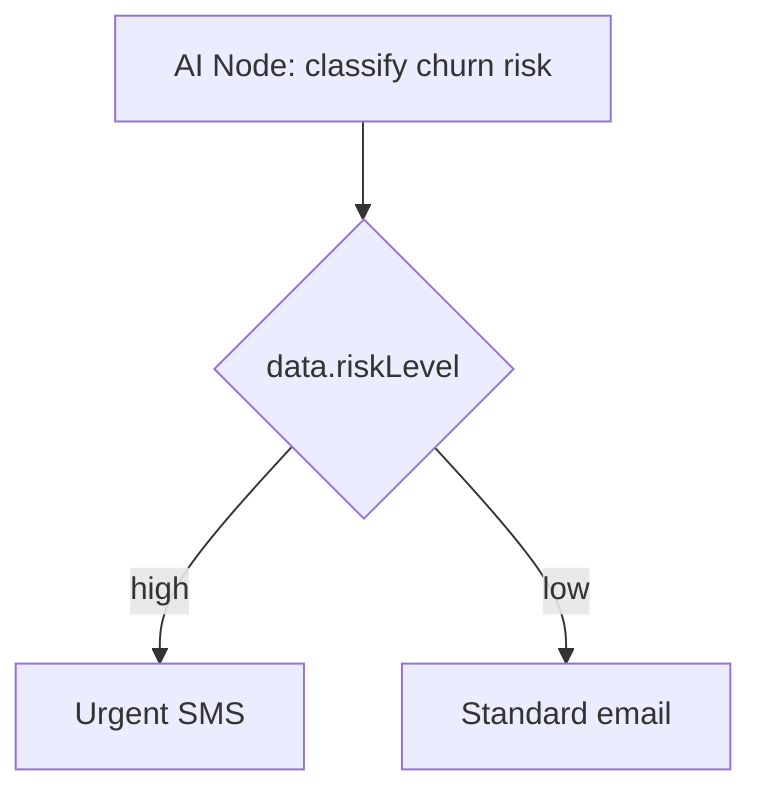

El **Nodo de IA** realiza llamadas a un modelo de lenguaje (LLM) configurado (OpenAI o Anthropic) en mitad de la ejecución de un flujo de trabajo. Úsalo para generar contenido dinámico, clasificar usuarios, calificar la intención y tomar decisiones de bifurcación no deterministas.

<Callout type="info">
  Esto representa **IA en tiempo de ejecución en flujos de trabajo**. Para la
  creación de plantillas asistida por IA en el editor del panel, consulta
  [Generación de contenido por IA](/docs/platform/features/ai-content).
</Callout>

## Configuración

| Campo         | Descripción                                                                      |
| ------------- | -------------------------------------------------------------------------------- |
| `prompt`      | Plantilla de Handlebars con contexto de suscriptor + disparador (trigger)        |
| `responseKey` | Clave para almacenar la salida del LLM en `ctx.data` (por defecto: `aiResponse`) |
| `conditions`  | [Condiciones de paso](/docs/platform/features/step-conditions) opcionales        |

## Ejemplo: asunto de correo personalizado

Prompt:

```
Write a short email subject line for {{ subscriber.externalId }} about order {{ data.orderId }}.
Tone: friendly, under 60 characters. Return only the subject text.
```

Plantilla de canal de email posterior:

```html
Subject: {{ aiResponse }}
```

## Ejemplo: bifurcación por riesgo de abandono (churn-risk)



El prompt devuelve contexto estructurado fusionado mediante `responseKey`. Vincula [condiciones de paso](/docs/platform/features/step-conditions) en los nodos posteriores basándote en la clave `data.riskLevel`.

## Configuración del proveedor

Configura las claves API de OpenAI o Anthropic en **Integrations → AI Providers**. El consumo de tokens se rastrea por ejecución para el análisis de costes.

## Medidas de protección (Guardrails)

- Tiempo de espera de solicitud por nodo.
- Ruta de fallback si el LLM falla (usa condiciones en una rama alternativa).
- Límites de coste configurables por nivel de plan de la organización.

## Relacionado

- [Generación de contenido por IA](/docs/platform/features/ai-content)
- [Condiciones de Paso](/docs/platform/features/step-conditions)
- [Nodo de Petición HTTP](/docs/platform/features/http-fetch-node)
