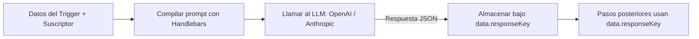
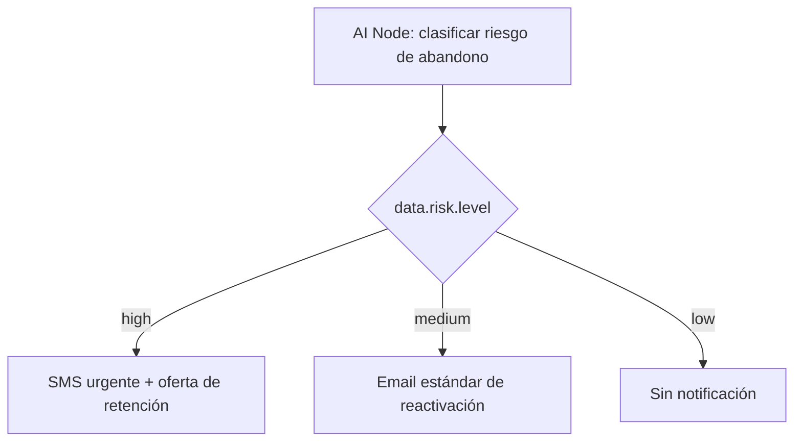

El **AI Node** realiza una llamada a un LLM configurado (OpenAI o Anthropic) durante la ejecución del workflow. El prompt se compila con el contexto de datos del suscriptor + trigger en vivo, y la respuesta se almacena de vuelta en `data` para las plantillas y condiciones subsiguientes.

<Callout type="info">
  Esto representa la **IA en tiempo de ejecución en workflows** — para la creación de plantillas
  asistida por IA en el editor del panel de control, consulta [Generación de contenido por
  IA](/docs/platform/features/ai-content).
</Callout>

---

## Cómo funciona



El LLM recibe instrucciones a través de un prompt del sistema fijo para devolver siempre un **objeto JSON válido**. La respuesta se analiza y se almacena bajo `data.<responseKey>`.

---

## Configuración

| Campo         | Tipo   | Requerido | Descripción                                                                                             |
| :------------ | :----- | :-------- | :------------------------------------------------------------------------------------------------------ |
| `prompt`      | string | ✅        | Plantilla de Handlebars con contexto del suscriptor + trigger                                           |
| `responseKey` | string | —         | Clave para almacenar la salida JSON del LLM bajo `data.*`. Por defecto es `ai`                          |
| `conditions`  | object | —         | [Condiciones de paso](/docs/platform/features/step-conditions) opcionales para condicionar la ejecución |

<Callout type="info">
  **`responseKey` por defecto**: Si no se especifica, la respuesta del LLM se almacena bajo
  `data.ai`. La clave debe comenzar con una letra y contener únicamente letras, dígitos y guiones
  bajos (`[a-zA-Z][a-zA-Z0-9_]*`).
</Callout>

---

## Ejemplo: asunto de correo personalizado

**Prompt del AI Node:**

```
Write a short email subject line for {{ subscriber.first_name }} about order {{ data.orderId }}.
Tone: friendly, under 60 characters.
Return a JSON object: { "subject": "<subject line here>" }
```

**Plantilla de correo posterior** (haciendo referencia a `data.ai.subject`):

```html
Subject: {{ data.ai.subject }}
<p>Hi {{ subscriber.first_name }}, your order {{ data.orderId }} is confirmed!</p>
```

O con una `responseKey: "copy"` personalizada:

```html
Subject: {{ data.copy.subject }}
```

---

## Ejemplo: bifurcación por riesgo de abandono (churn-risk)



**Prompt:**

```
Based on last active date {{ data.lastActiveAt }} and plan {{ data.plan }},
classify this user's churn risk.
Return JSON: { "level": "high" | "medium" | "low", "reason": "<brief reason>" }
```

**Condición de paso en el nodo de SMS** (basada en `data.risk.level`):

```json
{
  "logic": "AND",
  "rules": [{ "variable": "data.risk.level", "operator": "equals", "value": "high" }]
}
```

---

## Configuración del proveedor

Configura las claves de API de OpenAI o Anthropic en **Integrations → AI Providers** en el panel de control. El uso de tokens se rastrea por ejecución de workflow para el análisis de costos.

- **OpenAI**: Establece tu `OPENAI_API_KEY` a través de la integración en el panel de control.
- **Anthropic**: Establece tu `ANTHROPIC_API_KEY` a través de la integración en el panel de control.

Si no hay ninguna clave de proveedor de IA configurada, el nodo de IA se omite y registra `AI_NODE_FAILED` con la razón `No AI provider API key configured`.

---

## Manejo de errores y medidas de seguridad

- **Ninguna clave de API configurada**: El paso se omite, `data.<responseKey>` se establece en `null` y se registra `AI_NODE_FAILED`.
- **Tiempo de espera agotado (timeout) en la solicitud del LLM**: El paso se omite, `data.<responseKey>` se establece en `null` y se registra `AI_NODE_FAILED`.
- **Respuesta JSON no válida**: Se almacena tal cual; las plantillas posteriores deben manejarlo de forma segura mediante guardas `{{#if data.ai}}`.
- **Límites de costo**: Configurable por nivel de plan de la organización en la configuración del panel de control.

---

## Workflow-as-code

```ts
import { defineWorkflow } from '@nexus-signal/node';

defineWorkflow('payment.overdue')
  .addHttpFetch({
    url: 'https://api.billing.com/invoices/{{ data.invoiceId }}',
    method: 'GET',
    responseKey: 'invoice',
  })
  .addAiNode({
    prompt:
      'Classify urgency for invoice {{ data.invoice.amount }} due {{ data.invoice.dueDate }}. Return JSON: { "level": "low" | "medium" | "high" }',
    responseKey: 'risk',
  })
  .addChannel('EMAIL')
  .addChannel('SMS', {
    conditions: {
      logic: 'AND',
      rules: [{ variable: 'data.risk.level', operator: 'equals', value: 'high' }],
    },
  })
  .toDefinition();
```

---

## Relacionado

- [Generación de contenido por IA](/docs/platform/features/ai-content)
- [Condiciones de paso](/docs/platform/features/step-conditions)
- [Nodo HTTP Fetch](/docs/platform/features/http-fetch-node)
- [Workflow-as-code](/docs/sdk/workflow/workflow-as-code)
