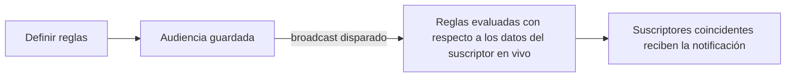

Las **audiencias** (Audiences) son segmentos dinámicos y nombrados definidos por reglas de filtrado aplicadas a los campos del suscriptor. Los conteos de miembros se actualizan automáticamente a medida que cambian los datos del suscriptor — sin necesidad de un mantenimiento manual de la lista.

---

## Cómo funcionan las audiencias

Las reglas de la audiencia se evalúan **en el momento del envío** (cuando se dispara un broadcast), no en el momento de la creación. Esto significa que un suscriptor que se une a tu plan `"growth"` hoy se incluirá en la audiencia coincidente cuando realices el envío mañana.



---

## Campos filtrables

Las reglas de la audiencia pueden filtrar por los siguientes campos de suscriptor:

| Campo                | Tipo     | Valores de ejemplo     |
| :------------------- | :------- | :--------------------- |
| `email`              | string   | `"user@example.com"`   |
| `phoneNumber`        | string   | `"+14155552671"`       |
| `locale`             | string   | `"en"`, `"es"`, `"ja"` |
| `timezone`           | string   | `"America/New_York"`   |
| `globalUnsubscribed` | boolean  | `true`, `false`        |
| `externalId`         | string   | `"user_42"`            |
| `createdAt`          | datetime | Cadena ISO 8601        |

<Callout type="warn">
  Los campos personalizados de `properties` del suscriptor (por ejemplo, `properties.plan`) **no**
  son directamente filtrables en las reglas de la audiencia. Los filtros de audiencia se limitan a
  los campos estándar del suscriptor listados anteriormente.
</Callout>

---

## Operadores compatibles

| Operador                     | Funciona en                                       |
| :--------------------------- | :------------------------------------------------ |
| `equals` / `not_equals`      | Todos los campos string y booleanos               |
| `contains` / `not_contains`  | Campos string                                     |
| `starts_with` / `ends_with`  | Campos string                                     |
| `is_empty` / `is_not_empty`  | Campos string                                     |
| `is_true` / `is_false`       | Campos booleanos                                  |
| `greater_than` / `less_than` | Campos de fecha/número (por ejemplo, `createdAt`) |

Máximo de 10 reglas por audiencia.

---

## Crear una audiencia

**Panel de control**: Página de **Audiences** → **New Audience** → añadir reglas.

**API (Gestión, clave `sk_*`):**

```http
POST /v1/management/audiences
Authorization: Bearer sk_prd_…
Content-Type: application/json
```

```json
{
  "name": "English locale subscribers",
  "description": "Subscribers whose locale is set to English",
  "filters": {
    "logic": "AND",
    "rules": [
      { "field": "locale", "operator": "equals", "value": "en" },
      { "field": "globalUnsubscribed", "operator": "is_false" }
    ]
  }
}
```

**API (Panel/Navegador, autenticación por JWT):**

```http
POST /v1/audiences
Authorization: Bearer <jwt_token>
```

---

## Vista previa de miembros

El panel de control muestra un **conteo de miembros en tiempo real** mientras editas las reglas. También puedes obtener los miembros a través de la API:

```http
GET /v1/audiences/:id/members?page=1&limit=50
Authorization: Bearer <jwt_token>
```

Devuelve una lista paginada de suscriptores que coinciden con las reglas actuales.

---

## Uso en broadcasts

Las audiencias se utilizan como el objetivo destinatario para los [Broadcasts](/docs/platform/features/broadcasts):

```json
{
  "name": "English User Re-engagement",
  "workflowId": "<workflow-uuid>",
  "audienceId": "<audience-uuid>",
  "scheduledAt": "2026-09-01T09:00:00Z"
}
```

<Callout type="info">
  Un broadcast **debe** tener un `audienceId` asignado antes de poder ser enviado. Intentar enviar
  un broadcast sin una audiencia devuelve un error `400`.
</Callout>

---

## Límites

| Límite                           | Valor |
| :------------------------------- | :---- |
| Máximo de audiencias por entorno | 50    |
| Máximo de reglas por audiencia   | 10    |

---

## Relacionado

- [Broadcasts](/docs/platform/features/broadcasts)
- [API de Audiencias](/docs/api/audiences)
- [API de Suscriptores](/docs/api/subscribers)
