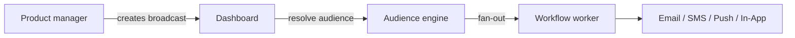

Los **broadcasts** permiten a los equipos de producto y marketing enviar anuncios, lanzamientos de funciones y avisos de mantenimiento desde el panel de control sin necesidad de realizar cambios en el código.

## En qué se diferencian los broadcasts de los disparadores (triggers)

|               | Disparador de eventos (Trigger)  | Broadcast                         |
| ------------- | -------------------------------- | --------------------------------- |
| Iniciado por  | Código en tu backend             | Panel de control o API de Gestión |
| Destinatarios | Lista explícita u objetos        | Segmento de audiencia             |
| Caso de uso   | Transaccional, basado en eventos | Anuncios, campañas                |



## Crear un broadcast

Desde el panel en la sección **Broadcasts** → redacta el flujo de trabajo (workflow) + selecciona la audiencia + programa la fecha de envío.

A través de la API de Gestión (requiere clave `sk_*`):

```http
POST /v1/management/broadcasts
Authorization: Bearer sk_prd_…
```

```json
{
  "name": "Q4 Product Update",
  "workflowId": "uuid",
  "audienceId": "uuid",
  "scheduledAt": "2026-08-01T09:00:00Z"
}
```

Enviar inmediatamente:

```http
POST /v1/management/broadcasts/:id/send
```

Los usuarios del panel de control también pueden realizar creaciones mediante `POST /v1/broadcasts` con autenticación JWT — ver [API de Broadcasts](/docs/api/broadcasts).

## Ciclo de vida de un Broadcast

| Estado                 | Significado                                  |
| ---------------------- | -------------------------------------------- |
| `DRAFT`                | Redactado, aún no enviado                    |
| `SCHEDULED`            | En cola para envío futuro                    |
| `SENDING`              | Envío masivo en progreso                     |
| `COMPLETED`            | Todos los destinatarios han sido procesados  |
| `FAILED` / `CANCELLED` | Error en el envío o cancelado por el usuario |

## Analíticas

Las estadísticas de entrega, aperturas y clics específicas de cada broadcast aparecen en la vista detallada del broadcast dentro del panel.

## Relacionado

- [Guía de tu primer broadcast](/docs/platform/guides/first-broadcast)
- [Audiences](/docs/platform/features/audiences)
- [API de Broadcasts](/docs/api/broadcasts)
