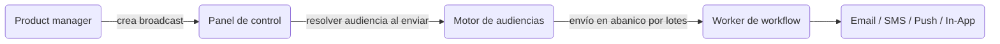

Los **broadcasts** permiten a los equipos de producto y marketing enviar anuncios, lanzamientos de funciones y avisos de mantenimiento desde el panel de control — sin necesidad de realizar cambios en el código. Utilizan [Audiencias](/docs/platform/features/audiences) como su objetivo destinatario y ejecutan cualquier workflow existente.

---

## En qué se diferencian los broadcasts de los disparadores

|                    | Disparador de evento (Event trigger) | Broadcast                         |
| :----------------- | :----------------------------------- | :-------------------------------- |
| **Iniciado por**   | Código de tu backend                 | Panel de control o API de Gestión |
| **Destinatarios**  | Suscriptores explícitos u objetos    | Segmento de audiencia (requerido) |
| **Sincronización** | Inmediato (asíncrono 202)            | Inmediato o programado            |
| **Caso de uso**    | Transaccional, basado en eventos     | Anuncios, campañas, reactivación  |



---

## Ciclo de vida del broadcast

| Estado      | Significado                                                                                |
| :---------- | :----------------------------------------------------------------------------------------- |
| `DRAFT`     | Redactado, aún no enviado. Totalmente editable.                                            |
| `SCHEDULED` | Encolado para una fecha futura de `scheduledAt`. Se puede cancelar o editar.               |
| `SENDING`   | Envío en abanico en progreso. No se puede editar ni eliminar.                              |
| `COMPLETED` | Todos los destinatarios procesados. Los fallos parciales siguen resultando en `COMPLETED`. |
| `FAILED`    | Fallaron todos los lotes de destinatarios.                                                 |
| `CANCELLED` | Cancelado manualmente por un usuario (desde `SCHEDULED` o `SENDING`).                      |

<Callout type="info">
  Los broadcasts cambian permanentemente a `FAILED` únicamente cuando fallan **todos** los
  destinatarios. Si se entrega al menos a un destinatario, el estado es `COMPLETED`.
</Callout>

---

## Crear un broadcast

**Panel de control**: **Broadcasts** → **New Broadcast** → seleccionar workflow + audiencia → establecer programación.

**API de Gestión (clave `sk_*` — para automatización del lado del servidor):**

```http
POST /v1/management/broadcasts
Authorization: Bearer sk_prd_…
Content-Type: application/json
```

```json
{
  "name": "Q4 Product Update",
  "workflowId": "<workflow-uuid>",
  "audienceId": "<audience-uuid>",
  "data": { "version": "4.0", "changelogUrl": "https://blog.example.com/q4" },
  "scheduledAt": "2026-08-01T09:00:00Z"
}
```

Omite `scheduledAt` para crearlo como `DRAFT` (enviar manualmente más tarde). Inclúyelo para establecer inmediatamente el estado a `SCHEDULED`.

**API del Panel de control (autenticación JWT — para integraciones frontend):**

```http
POST /v1/broadcasts
Authorization: Bearer <jwt_token>
```

---

## Enviar inmediatamente

Envía un broadcast en estado `DRAFT` o `SCHEDULED` ahora mismo:

```http
POST /v1/management/broadcasts/:id/send
Authorization: Bearer sk_prd_…
```

O a través del panel de control: abre los detalles del broadcast → **Send Now** (Enviar ahora).

---

## Cancelar un broadcast

```http
POST /v1/broadcasts/:id/cancel
Authorization: Bearer <jwt_token>
```

Únicamente se pueden cancelar los broadcasts en estado `SCHEDULED` o `SENDING`.

---

## Pasar datos al workflow

El campo `data` en un broadcast se pasa como payload del trigger al workflow para cada destinatario. Utiliza esto para contenido dinámico como changelogs, URLs o códigos promocionales:

```json
{
  "data": {
    "promoCode": "LAUNCH40",
    "expiresAt": "2026-09-01"
  }
}
```

En tu plantilla de correo de workflow: `{{ data.promoCode }}`, `{{ data.expiresAt }}`.

---

## Analíticas

Las estadísticas de entrega, aperturas y clics específicas de cada broadcast aparecen en la vista de detalles del broadcast del panel de control después de enviarlo:

- `totalRecipients` — tamaño de la audiencia al enviar
- `deliveredCount` — aceptados con éxito por el proveedor
- `failedCount` — rechazos del proveedor o errores de procesamiento

---

## Límites

| Límite                                              | Valor                     |
| :-------------------------------------------------- | :------------------------ |
| Máximo de broadcasts por entorno                    | 200                       |
| Tamaño de lote para envío en abanico                | 100 suscriptores por lote |
| Intervalo de comprobación de broadcasts programados | Cada 60 segundos          |

---

## Relacionado

- [Guía de tu primer broadcast](/docs/platform/guides/first-broadcast)
- [Audiences](/docs/platform/features/audiences)
- [API de Broadcasts](/docs/api/broadcasts)
